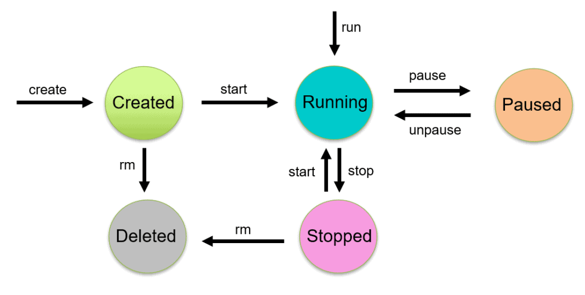
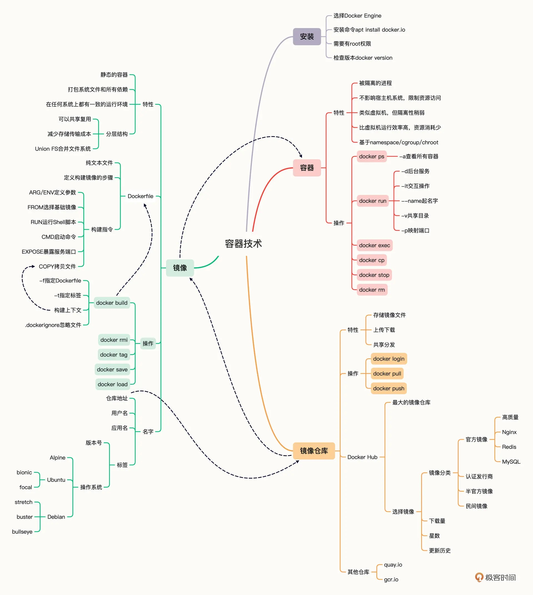

# Docker架构

Docker是c/s架构，架构图如下：

`Docker daemon`：简称`dockerd`，作为服务端，处理Client发过来的请求，管理Docker镜像、容器、网络和存储。

`Docker client`: 作为客户端和`dockerd`服务端交互，使用的是RESTful API。docker命令行工具CLI和带界面的docker客户端都可以称为Docker client。Docker client可以和多个dockerd交互。

`Docker Registry`：Docker镜像仓库，用来存储Docker镜像，有公共仓库(public registry)和私有仓库(private registry)，类似GitHub的Public Repo和Private Repo。使用`docker pull`或`docker run`命令时，会从我们配置的registry仓库拉取镜像。使用`docker push`命令，会把镜像推送到我们配置的registry仓库。

`Docker images`： Docker镜像，是一个只读文件，里面有创建Docker容器的指令。一个镜像可以基于其它镜像来创建，比如我们可以基于已有的`ubuntu`镜像，添加Nginx和自己的应用程序来创建一个新的镜像。如果要创建自己的镜像文件，需要创建名为Dockerfile的文件，在该文件里按照指定的语法规则来定义创建和运行镜像文件的步骤。**Dockerfile文件名也可以自定义，但是使用`docker build`构建镜像时就需要搭配`-f`选项来指定Dockerfile文件**。

`Docker containers`：Docker容器，是镜像的运行实例，一个容器实际上就是一个被隔离的进程(isolated process)。Docker容器的生命周期如下图所示：

`Docker Engine`：包含有Docker daemon, RESTful API, Docker CLI。

# Docker安装

​	安装Desktop即可，Desktop支持Mac, Windows和Linux系统，包含了使用Docker所需要的一切工具集。

​	安装步骤参考：https://docs.docker.com/get-docker/

​							 https://mirrors.tuna.tsinghua.edu.cn/help/docker-ce/

# Docker服务的相关命令

​	**推荐在root管理权限下使用docker**

1. `systemctl  start docker`    开启docker服务 （需要在root权限下）
2. `systemctl enable docker`   设为开机自启（需要在root权限下）
3. `docker version` 查看docker版本      docker是用go语言开发
4. `docker info`      查看docker的信息
5. `docker inspect`  
6. `systemctl restart docker`   重启docker服务（需要在root权限下）

Docker的入门思维导图如下：

