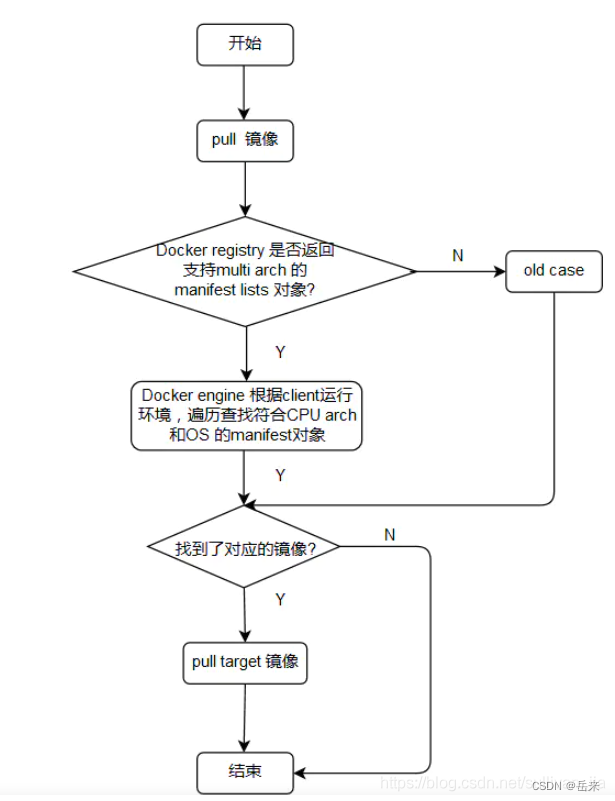

# 构建多种系统架构支持的 Docker 镜像

​	我们知道使用镜像创建一个容器，该镜像必须与 Docker 宿主机系统架构一致，例如 `Linux x86_64` 架构的系统中只能使用 `Linux x86_64` 的镜像创建容器。

> Windows、macOS 除外，其使用了 [binfmt_misc](https://docs.docker.com/docker-for-mac/multi-arch/) 提供了多种架构支持，在 Windows、macOS 系统上 (x86_64) 可以运行 arm 等其他架构的镜像。

​	例如我们在 `Linux x86_64` 中构建一个 `username/test` 镜像。

```dockerfile
FROM alpine
CMD echo 1
```

​	构建镜像后推送到 Docker Hub，之后我们尝试在树莓派 `Linux arm64v8` 中使用这个镜像。

```shell
$ docker run -it --rm username/test
```

​	可以发现这个镜像根本获取不到。

​	要解决这个问题，通常采用的做法是通过镜像名区分不同系统架构的镜像，例如在 `Linux x86_64` 和 `Linux arm64v8` 分别构建 `username/test` 和 `username/arm64v8-test` 镜像。运行时使用对应架构的镜像即可。

​	这样做显得很繁琐，那么有没有一种方法让 Docker 引擎根据系统架构自动拉取对应的镜像呢？

​	我们发现在 `Linux x86_64` 和 `Linux arm64v8` 架构的计算机中分别使用 `golang:alpine` 镜像运行容器 `$ docker run golang:alpine go version` 时，容器能够正常的运行。

​	这是什么原因呢？

​	原因就是 `golang:alpine` 官方镜像有一个 [`manifest` 列表 (`manifest list`)](https://docs.docker.com/registry/spec/manifest-v2-2/)。

​	当用户获取一个镜像时，Docker 引擎会首先查找该镜像是否有 `manifest` 列表，如果有的话 Docker 引擎会按照 Docker 运行环境（系统及架构）查找出对应镜像（例如 `golang:alpine`）。如果没有的话会直接获取镜像（例如上例中我们构建的 `username/test`）。

​	我们可以使用 `$ docker manifest inspect golang:alpine` 查看这个 `manifest` 列表的结构。

```shell
$ docker manifest inspect golang:alpine

{

   "schemaVersion": 2,

   "mediaType": "application/vnd.docker.distribution.manifest.list.v2+json",

   "manifests": [

     {

         "mediaType": "application/vnd.docker.distribution.manifest.v2+json",

         "size": 1365,

         "digest": "sha256:5e28ac423243b187f464d635bcfe1e909f4a31c6c8bce51d0db0a1062bec9e16",

         "platform": {

            "architecture": "amd64",

            "os": "linux"

         }

      },

      {

         "mediaType": "application/vnd.docker.distribution.manifest.v2+json",

         "size": 1365,

         "digest": "sha256:2945c46e26c9787da884b4065d1de64cf93a3b81ead1b949843dda1fcd458bae",

         "platform": {

            "architecture": "arm",

            "os": "linux",

            "variant": "v7"

         }

      },

      {

         "mediaType": "application/vnd.docker.distribution.manifest.v2+json",

         "size": 1365,

         "digest": "sha256:87fff60114fd3402d0c1a7ddf1eea1ded658f171749b57dc782fd33ee2d47b2d",

         "platform": {

            "architecture": "arm64",

            "os": "linux",

            "variant": "v8"

         }

      },

      {

         "mediaType": "application/vnd.docker.distribution.manifest.v2+json",

         "size": 1365,

         "digest": "sha256:607b43f1d91144f82a9433764e85eb3ccf83f73569552a49bc9788c31b4338de",

         "platform": {

            "architecture": "386",

            "os": "linux"

         }

      },

      {

         "mediaType": "application/vnd.docker.distribution.manifest.v2+json",

         "size": 1365,

         "digest": "sha256:25ead0e21ed5e246ce31e274b98c09aaf548606788ef28eaf375dc8525064314",

         "platform": {

            "architecture": "ppc64le",

            "os": "linux"

         }

      },

      {

         "mediaType": "application/vnd.docker.distribution.manifest.v2+json",

         "size": 1365,

         "digest": "sha256:69f5907fa93ea591175b2c688673775378ed861eeb687776669a48692bb9754d",

         "platform": {

            "architecture": "s390x",

            "os": "linux"

         }

      }

   ]

}
```

​	可以看出 `manifest` 列表中包含了不同系统架构所对应的镜像 `digest` 值，这样 Docker 就可以在不同的架构中使用相同的 `manifest` (例如 `golang:alpine`) 获取对应的镜像。

​	manifest是一个文件，这个文件包含了有关于镜像信息，如层、大小和摘要。`docker manifest`命令还向用户提供附加信息，比如构建镜像的操作系统和体系结构。而manifest list是一个镜像清单列表，用于存放多个不同os/arch的镜像信息。我们可以创建一个manifest list来指向两个镜像(一个linux 64位和一个指向arm64位的镜像)，然后对用户提供一个唯一的镜像名称。**需要注意的是，manifest文件仅仅是针对于已经在仓库中的镜像！！！ 换句话说，就是这个镜像是刚从仓库中pull下来的！如果这个镜像是自己build的，需要先push到仓库中，否则，这个镜像是没有manifest文件的！！同样的，如果你pull了一个镜像，tag了一下，再去看这个manifest文件，也是没有的，因为tag后的镜像不在镜像仓库中。**原理如图：



## 使用环境

### docker 服务端支持

​	docker manifest是一个实验特性，当前在docker 20.10及其之后版本是默认支持的，在之前版本需要开启此特性，开启方法如下：

1. 修改/etc/docker/daemon.json 文件，如果没有，新建并添加；如果有，追加后即可，记得检查逗号。

   ```shell
   vim /etc/docker/daemon.json
   {
     "experimental": true
   }
   ```

2. 开启experimental，有两种方法：

   - 临时法。设置环境变量即可，但是下次进入界面时，也需要设置（不过可以通过修改/etc/profile，使其成为永久变量）
     `export DOCKER_CLI_EXPERIMENTAL=enabled`

   - 永久法。修改 ~/.docker/config.json 文件，如下，有则追加，无则新建。

     ```shell
     vim ~/.docker/config.json
     {
         "experimental": "enabled"
     }
     ```

3. 完成上述步骤后，`systemctl restart docker` 即可。

### docker registry 支持

​	从docker registry v2.3开始，Docker hub就可以pull multi architecture Docker镜像了


## 构建镜像

首先在 `Linux x86_64` 构建 `username/x8664-test` 镜像。并在 `Linux arm64v8` 中构建 `username/arm64v8-test` 镜像，构建好之后推送到 Docker Hub。


### 创建 `manifest` 列表

```shell
# $ docker manifest create MANIFEST_LIST MANIFEST [MANIFEST...]

$ docker manifest create username/test \
      username/x8664-test \
      username/arm64v8-test
```

​	当要修改一个 `manifest` 列表时，可以加入 `-a` 或 `--amend` 参数。


### 设置 `manifest` 列表

```shell
# $ docker manifest annotate [OPTIONS] MANIFEST_LIST MANIFEST

$ docker manifest annotate username/test \
      username/x8664-test \
      --os linux --arch x86_64


$ docker manifest annotate username/test \
      username/arm64v8-test \
      --os linux --arch arm64 --variant v8
```

​	这样就配置好了 `manifest` 列表。


### 查看 `manifest` 列表

```shell
$ docker manifest inspect username/test
```


### 推送 `manifest` 列表

​	最后我们可以将其推送到 Docker Hub。

```shell
$ docker manifest push username/test
```


### 测试

​	我们在 `Linux x86_64` `Linux arm64v8` 中分别执行 `$ docker run -it --rm username/test` 命令，发现可以正确的执行。


## 官方博客

详细了解 `manifest` 可以阅读官方博客。

- https://www.docker.com/blog/multi-arch-all-the-things/