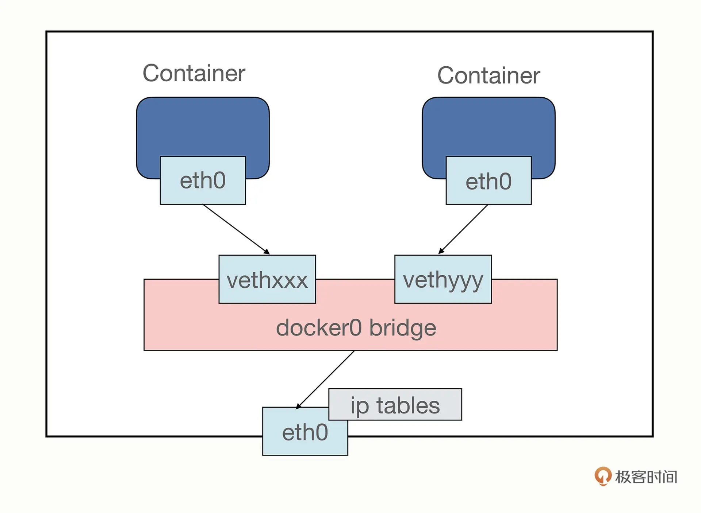

# Docker默认的网络模式

​	首先我们使用查看ip地址的命令`ip addr`查看下当前的网络地址有哪些：

```shell
[root@192 ~]# ip addr
1: lo: <LOOPBACK,UP,LOWER_UP> mtu 65536 qdisc noqueue state UNKNOWN group default qlen 1000
    link/loopback 00:00:00:00:00:00 brd 00:00:00:00:00:00
    inet 127.0.0.1/8 scope host lo
       valid_lft forever preferred_lft forever
    inet6 ::1/128 scope host 
       valid_lft forever preferred_lft forever
2: ens33: <BROADCAST,MULTICAST,UP,LOWER_UP> mtu 1500 qdisc pfifo_fast state UP group default qlen 1000
    link/ether 00:0c:29:39:b4:c3 brd ff:ff:ff:ff:ff:ff
    inet 192.168.5.102/24 brd 192.168.5.255 scope global noprefixroute ens33
       valid_lft forever preferred_lft forever
    inet6 fe80::f808:3fa:3eec:4af6/64 scope link noprefixroute 
       valid_lft forever preferred_lft forever
3: virbr0: <NO-CARRIER,BROADCAST,MULTICAST,UP> mtu 1500 qdisc noqueue state DOWN group default qlen 1000
    link/ether 52:54:00:0b:48:4f brd ff:ff:ff:ff:ff:ff
    inet 192.168.122.1/24 brd 192.168.122.255 scope global virbr0
       valid_lft forever preferred_lft forever
4: virbr0-nic: <BROADCAST,MULTICAST> mtu 1500 qdisc pfifo_fast master virbr0 state DOWN group default qlen 1000
    link/ether 52:54:00:0b:48:4f brd ff:ff:ff:ff:ff:ff
5: docker0: <NO-CARRIER,BROADCAST,MULTICAST,UP> mtu 1500 qdisc noqueue state DOWN group default 
    link/ether 02:42:c5:e1:d8:5b brd ff:ff:ff:ff:ff:ff
    inet 172.17.0.1/16 brd 172.17.255.255 scope global docker0
       valid_lft forever preferred_lft forever
[root@192 ~]# 
```

​	以上各个网络地址解释如下：

1. lo为本机环回地址，也就是我自己的windows主机。
2. ens33是虚拟机TML-2的地址，也就是Docker的宿主机的网络地址192.168.5.102。
3. virbr0 是一种虚拟网络接口，这是由于安装和启用了 libvirt 服务后生成的，libvirt 在服务器（host）上生成一个 virtual network switch (virbr0)，host 上所有的虚拟机（guests）通过这个 virbr0 连起来。默认情况下 virbr0 使用的是 NAT 模式（采用 IP Masquerade），所以这种情况下 guest 通过 host 才能访问外部。centos virbr0是KVM默认创建的一个Bridge，其作用是为连接其上的虚机网卡提供NAT访问外网的功能；virbr0默认分配一个IP“192.168.122.1”，并为其他虚拟网卡提供DHCP服务。
4. virbr0-nic 代表虚拟网桥NIC。 它基本上是物理网卡和虚拟机的虚拟网卡之间的桥梁。
5. docker0即是docker使用的网络地址。

​	属实是三层套娃了。使用以下命令查看所有的Docker网络模式：

```shell
[root@192 ~]# docker network ls
NETWORK ID     NAME      DRIVER    SCOPE
173795075c5b   bridge    bridge    local
fcddcee8a2d1   host      host      local
9efbda880fae   none      null      local
[root@192 ~]# 
```

​	Docker默认提供了四个网络模式，说明：

- bridge：容器默认的网络是桥接模式(自己搭建的网络默认也是使用桥接模式,启动容器默认也是使用桥接模式)。此模式会为每一个容器分配、设置IP等，并将容器连接到一个docker0虚拟网桥，通过docker0网桥以及Iptables nat表配置与宿主机通信。
- none：不配置网络，容器有独立的Network namespace，但并没有对其进行任何网络设置，如分配veth pair 和网桥连接，配置IP等。
- host：容器和宿主机共享Network namespace。容器将不会虚拟出自己的网卡，配置自己的IP等，而是使用宿主机的IP和端口。
- container：创建的容器不会创建自己的网卡，配置自己的IP容器网络连通。容器和另外一个容器共享Network namespace（共享IP、端口范围）。

​	容器默认使用bridge网络模式，我们使用该docker run --network=选项指定容器使用的网络：

```
host模式：使用 --net=host 指定。
none模式：使用 --net=none 指定。
bridge模式：使用 --net=bridge 指定，默认设置。
container模式：使用 --net=container:NAME_or_ID 指定
```


​	Namespace：Docker使用了Linux的Namespaces技术来进行资源隔离，如PID Namespace隔离进程，Mount Namespace隔离文件系统，Network Namespace隔离网络等。

## none

​	**使用none模式，Docker容器拥有自己的Network Namespace，但是，并不为Docker容器进行任何网络配置。也就是说，这个Docker容器没有网卡、IP、路由等信息**。需要我们自己为Docker容器添加网卡、配置IP等。


## host 

​	host的意思是直接使用宿主机网络，相当于去掉了容器的网络隔离（其他隔离依然保留），所有的容器会共享宿主机的 IP 地址和网卡。这种模式没有中间层，自然通信效率高，但缺少了隔离，运行太多的容器也容易导致端口冲突。

​	host 模式需要在 docker run 时使用 --net=host 参数，下面我就用这个参数启动 Nginx：

```shell
docker run -d --rm --net=host nginx:alpine
```

## container

​	这个模式**指定新创建的容器和已经存在的一个容器共享一个 Network Namespace，而不是和宿主机共享**。新创建的容器不会创建自己的网卡，配置自己的 IP，而是和一个指定的容器共享 IP、端口范围等。

## bridge

​	桥接模式，它有点类似现实世界里的交换机、路由器，只不过是由软件虚拟出来的，容器和宿主机再通过虚拟网卡接入这个网桥（图中的 docker0），那么它们之间也就可以正常的收发网络数据包了。不过和 host 模式相比，bridge 模式多了虚拟网桥和网卡，通信效率会低一些。

​	当Docker进程启动时，会在宿主机上创建一个名为docker0的虚拟网桥，宿主机上启动的Docker容器会连接到这个虚拟网桥上。虚拟网桥的工作方式和物理交换机类似，这样主机上的所有容器就通过交换机连在了一个二层网络中。

​	从docker0子网中分配一个IP给容器使用，并设置docker0的IP地址为容器的默认网关。在主机上创建一对虚拟网卡veth pair设备，Docker将veth pair设备的一端放在新创建的容器中，并命名为eth0（容器的网卡），另一端放在主机中，以vethxxx这样类似的名字命名，并将这个网络设备加入到docker0网桥中。可以通过`brctl show`命令查看。

​	bridge模式是docker的默认网络模式，不写–net参数，就是bridge模式。使用docker run -p时，docker实际是在iptables做了DNAT规则，实现端口转发功能。可以使用iptables -t nat -vnL查看。




​	**端口号映射需要使用 bridge 模式，并且在 docker run 启动容器时使用 -p 参数，形式和共享目录的 -v 参数很类似，用 : 分隔本机端口和容器端口。**

​	当Docker server启动时，会在宿主机上创建一个名为docker0的虚拟网桥，此宿主机启动的Docker容器会连接到这个虚拟网桥上。Docker0使用到的技术是veth-pair技术。在默认bridge网络模式下，我们每启动一个Docker容器，Docker就会给Docker容器配置一个ip。Docker容器完成bridge网络配置的过程如下：

1. 在宿主机上创建一对虚拟网卡veth pair设备。veth设备总是成对出现的，它们组成了一个数据的通道，数据从一个设备进入，就会从另一个设备出来。因此，veth设备常用来连接两个网络设备。
2. Docker将veth pair设备的一端放在新创建的容器中，并命名为eth0。另一端放在主机中，以veth65f9这样类似的名字命名，并将这个网络设备加入到docker0网桥中。
3. 从docker0子网中分配一个IP给容器使用，并设置docker0的IP地址为容器的默认网关。

# Docker容器互联

​	在微服务部署的场景下，注册中心是使用服务名来唯一识别微服务的，而我们上线部署的时候微服务对应的IP地址可能会改动，所以我们需要使用容器名来配置容器间的网络连接。使用--link可以完成这个功能。首先不设置连接的情况下，是无法通过容器名来进行连接的：

```shell
[root@192 ~]# docker ps
CONTAINER ID   IMAGE                                    COMMAND                  CREATED          STATUS          PORTS                                         NAMES
6cd417097796   tomcat:8.0                               "catalina.sh run"        16 minutes ago   Up 16 minutes   0.0.0.0:49155->8080/tcp, :::49155->8080/tcp   tomcat01
50b626fc91d2   tianmaolin/tml-mydockerfile-tomcat:1.0   "/bin/sh -c '/usr/lo…"   11 hours ago     Up 11 hours     0.0.0.0:49154->8080/tcp, :::49154->8080/tcp   tomcat-tml
[root@192 ~]# docker exec -it tomcat01 ping 172.17.0.3
PING 172.17.0.3 (172.17.0.3) 56(84) bytes of data.
64 bytes from 172.17.0.3: icmp_seq=1 ttl=64 time=0.111 ms
64 bytes from 172.17.0.3: icmp_seq=2 ttl=64 time=0.117 ms
64 bytes from 172.17.0.3: icmp_seq=3 ttl=64 time=0.049 ms
64 bytes from 172.17.0.3: icmp_seq=4 ttl=64 time=0.042 ms
64 bytes from 172.17.0.3: icmp_seq=5 ttl=64 time=0.060 ms
[root@192 ~]# docker exec -it tomcat01 ping tomcat-tml
ping: unknown host tomcat-tml
```


​	接下来我们再创建一个容器tomcat02来连接tomcat01:

```shell
[root@192 ~]# docker run -d -P --name tomcat02 --link tomcat01  tomcat:8.0
[root@192 ~]# docker ps
CONTAINER ID   IMAGE                                    COMMAND                  CREATED          STATUS          PORTS                                         NAMES
3e862598e630   tomcat:8.0                               "catalina.sh run"        32 seconds ago   Up 30 seconds   0.0.0.0:49156->8080/tcp, :::49156->8080/tcp   tomcat02
6cd417097796   tomcat:8.0                               "catalina.sh run"        19 minutes ago   Up 19 minutes   0.0.0.0:49155->8080/tcp, :::49155->8080/tcp   tomcat01
50b626fc91d2   tianmaolin/tml-mydockerfile-tomcat:1.0   "/bin/sh -c '/usr/lo…"   11 hours ago     Up 11 hours     0.0.0.0:49154->8080/tcp, :::49154->8080/tcp   tomcat-tml
[root@192 ~]# docker exec -it tomcat02 ping tomcat01
PING tomcat01 (172.17.0.2) 56(84) bytes of data.
64 bytes from tomcat01 (172.17.0.2): icmp_seq=1 ttl=64 time=0.094 ms
64 bytes from tomcat01 (172.17.0.2): icmp_seq=2 ttl=64 time=0.045 ms
64 bytes from tomcat01 (172.17.0.2): icmp_seq=3 ttl=64 time=0.043 ms
64 bytes from tomcat01 (172.17.0.2): icmp_seq=4 ttl=64 time=0.043 ms
64 bytes from tomcat01 (172.17.0.2): icmp_seq=5 ttl=64 time=0.047 ms
64 bytes from tomcat01 (172.17.0.2): icmp_seq=6 ttl=64 time=0.087 ms
64 bytes from tomcat01 (172.17.0.2): icmp_seq=7 ttl=64 time=0.047 ms
64 bytes from tomcat01 (172.17.0.2): icmp_seq=8 ttl=64 time=0.115 ms
64 bytes from tomcat01 (172.17.0.2): icmp_seq=9 ttl=64 time=0.048 ms
64 bytes from tomcat01 (172.17.0.2): icmp_seq=10 ttl=64 time=0.047 ms
64 bytes from tomcat01 (172.17.0.2): icmp_seq=11 ttl=64 time=0.043 ms
```


​	但是反过来容器tomcat01通过容器名tomcat01直接ping容器tomcat02是不行的:

```shell
[root@192 ~]# docker exec -it tomcat01 ping tomcat02
ping: unknown host tomcat02
[root@192 ~]# 
```


​	这是因为--link的原理是在指定运行的容器上的/etc/hosts文件中添加容器名和ip地址的映射，如下：

```shell
[root@192 ~]# docker exec -it tomcat02 cat /etc/hosts 
127.0.0.1       localhost
::1     localhost ip6-localhost ip6-loopback
fe00::0 ip6-localnet
ff00::0 ip6-mcastprefix
ff02::1 ip6-allnodes
ff02::2 ip6-allrouters
172.17.0.2      tomcat01 6cd417097796
172.17.0.4      3e862598e630
[root@192 ~]# 
```


​	而tomcat01容器不能够通过容器名连接tomcat02是因为tomcat01容器中并没有添加容器名tomcat02和ip地址的映射。

```shell
[root@192 ~]# docker exec -it tomcat01 cat /etc/hosts
127.0.0.1       localhost
::1     localhost ip6-localhost ip6-loopback
fe00::0 ip6-localnet
ff00::0 ip6-mcastprefix
ff02::1 ip6-allnodes
ff02::2 ip6-allrouters
172.17.0.2      6cd417097796
[root@192 ~]# 
```

​	目前–link设置容器互连的方式已经不推荐使用。因为docker0不支持容器名访问，所以更多地选择自定义网络。

总结：

1. 当我们新建容器时，如果没有显示指定其使用的网络，那么默认会使用bridge网络
2. 当一个容器link到另一个容器时，该容器可以通过IP或容器名称访问被link的容器，而被link容器可以通过IP访问该容器，但是无法通过容器名称访问
3. 当被link的容器被删除时，创建link的容器也无法正常使用
4. 如果两个容器被加入到我们手动创建的网络时，那么该网络内的容器相互直接可以通过IP和名称同时访问。

# 自定义网络

​	因为docker0，默认情况下不能通过容器名进行访问。需要通过--link进行设置连接。这样的操作比较麻烦，更推荐的方式是自定义网络，容器都使用该自定义网络，就可以实现通过容器名来互相访问了。

​	Docker容器每次重启后容器IP是会发生变化的。这也意味着如果容器间使用IP地址来进行通信的话，一旦有容器重启，重启的容器将不再能被访问到。而Docker网络就能够解决这个问题。Docker 网络主要有以下两个作用：

- 容器间的互联和通信以及端口映射
- 容器IP变动时候可以通过服务名直接网络通信而不受到影响

​	因此只要是处于同一个Docker 网络下的容器就可以使用服务名进行直接访问，而无需担心重启。这也是Docker 网络最基本和常用的应用场景。

## network相关命令

```shell
docker network connect [OPTIONS] NETWORK CONTAINER:将一个容器连接至一个网络

docker network create [OPTIONS] NETWORK:创建一个网络

  OPTIONS
    -d, --driver string:管理网络的驱动(默认是bridge)
    --subnet strings:指定网络的网段(x.x.x.x/x格式)
    --gateway strings:指定网络的网关
    -o, --opt map:视驱动而定的可选的选项,例如:parent=eth0,指定使用的网络接口为eth0

docker network inspect NETWORK [NETWORK...]:展示一个或多个网络的细节

docker network ls:列出网络
```


下面先创建一个新的 Docker 网络。

```shell
$ docker network create -d bridge my-net
```

​	`-d` 参数指定 Docker 网络类型，有 `bridge` `overlay`。其中 `overlay` 网络类型用于**Swarm mode**。

## 连接容器

​	运行一个容器并连接到新建的 `my-net` 网络

```shell
$ docker run -it --rm --name busybox1 --network my-net busybox sh
```


​	打开新的终端，再运行一个容器并加入到 `my-net` 网络

```shell
$ docker run -it --rm --name busybox2 --network my-net busybox sh
```


​	再打开一个新的终端查看容器信息

```shell
$ docker container ls

CONTAINER ID        IMAGE               COMMAND             CREATED             STATUS              PORTS               NAMES

b47060aca56b        busybox             "sh"                11 minutes ago      Up 11 minutes                           busybox2

8720575823ec        busybox             "sh"                16 minutes ago      Up 16 minutes                           busybox1
```

​	下面通过 `ping` 来证明 `busybox1` 容器和 `busybox2` 容器建立了互联关系。

​	在 `busybox1` 容器输入以下命令

```shell
/ # ping busybox2

PING busybox2 (172.19.0.3): 56 data bytes
64 bytes from 172.19.0.3: seq=0 ttl=64 time=0.072 ms
64 bytes from 172.19.0.3: seq=1 ttl=64 time=0.118 ms
```


​	用 ping 来测试连接 `busybox2` 容器，它会解析成 `172.19.0.3`。

​	同理在 `busybox2` 容器执行 `ping busybox1`，也会成功连接到。

```shell
/ # ping busybox1

PING busybox1 (172.19.0.2): 56 data bytes
64 bytes from 172.19.0.2: seq=0 ttl=64 time=0.064 ms
64 bytes from 172.19.0.2: seq=1 ttl=64 time=0.143 ms
```

​	这样，`busybox1` 容器和 `busybox2` 容器建立了互联关系。


# 配置 DNS

​	如何自定义配置容器的主机名和 DNS 呢？秘诀就是 Docker 利用虚拟文件来挂载容器的 3 个相关配置文件。

​	在容器中使用 `mount` 命令可以看到挂载信息：

```shell
$ mount

/dev/disk/by-uuid/1fec...ebdf on /etc/hostname type ext4 ...
/dev/disk/by-uuid/1fec...ebdf on /etc/hosts type ext4 ...
tmpfs on /etc/resolv.conf type tmpfs ...
```

​	这种机制可以让宿主主机 DNS 信息发生更新后，所有 Docker 容器的 DNS 配置通过 `/etc/resolv.conf` 文件立刻得到更新。配置全部容器的 DNS ，也可以在 `/etc/docker/daemon.json` 文件中增加以下内容来设置。

```json
{
  "dns" : [
    "114.114.114.114",
    "8.8.8.8"
  ]
}
```

​	这样每次启动的容器 DNS 自动配置为 `114.114.114.114` 和 `8.8.8.8`。使用以下命令来证明其已经生效。

```shell
$ docker run -it --rm ubuntu:18.04  cat /etc/resolv.conf

nameserver 114.114.114.114
nameserver 8.8.8.8
```

​	如果用户想要手动指定容器的配置，可以在使用 `docker run` 命令启动容器时加入如下参数：

​	`-h HOSTNAME` 或者 `--hostname=HOSTNAME` 设定容器的主机名，它会被写到容器内的 `/etc/hostname` 和 `/etc/hosts`。但它在容器外部看不到，既不会在 `docker container ls` 中显示，也不会在其他的容器的 `/etc/hosts` 看到。

​	`--dns=IP_ADDRESS` 添加 DNS 服务器到容器的 `/etc/resolv.conf` 中，让容器用这个服务器来解析所有不在 `/etc/hosts` 中的主机名。

​	`--dns-search=DOMAIN` 设定容器的搜索域，当设定搜索域为 `.example.com` 时，在搜索一个名为 host 的主机时，DNS 不仅搜索 host，还会搜索 `host.example.com`。

> 注意：如果在容器启动时没有指定最后两个参数，Docker 会默认用主机上的 `/etc/resolv.conf` 来配置容器。


# 实例：创建一个点到点连接

> 参考：https://blog.csdn.net/m0_52544877/article/details/121732634

​	默认情况下，Docker 会将所有容器连接到由 `docker0` 提供的虚拟子网中。

​	用户有时候需要两个容器之间可以直连通信，而不用通过主机网桥进行桥接。解决办法很简单：创建一对 `peer` 接口，分别放到两个容器中，配置成点到点链路类型即可。

​	首先启动 2 个容器：

```shell
$ docker run -i -t --rm --net=none base /bin/bash

root@1f1f4c1f931a:/#

$ docker run -i -t --rm --net=none base /bin/bash

root@12e343489d2f:/#
```

​	找到进程号，然后创建网络命名空间的跟踪文件。

```shell
$ docker inspect -f '{{.State.Pid}}' 1f1f4c1f931a
2989

$ docker inspect -f '{{.State.Pid}}' 12e343489d2f
3004

$ sudo mkdir -p /var/run/netns
$ sudo ln -s /proc/2989/ns/net /var/run/netns/2989
$ sudo ln -s /proc/3004/ns/net /var/run/netns/3004
```

​	创建一对 `peer` 接口，然后配置路由

```shell
$ sudo ip link add A type veth peer name B


$ sudo ip link set A netns 2989
$ sudo ip netns exec 2989 ip addr add 10.1.1.1/32 dev A
$ sudo ip netns exec 2989 ip link set A up
$ sudo ip netns exec 2989 ip route add 10.1.1.2/32 dev A


$ sudo ip link set B netns 3004
$ sudo ip netns exec 3004 ip addr add 10.1.1.2/32 dev B
$ sudo ip netns exec 3004 ip link set B up
$ sudo ip netns exec 3004 ip route add 10.1.1.1/32 dev B
```

​	现在这 2 个容器就可以相互 ping 通，并成功建立连接。点到点链路不需要子网和子网掩码。

​	此外，也可以不指定 `--net=none` 来创建点到点链路。这样容器还可以通过原先的网络来通信。利用类似的办法，可以创建一个只跟主机通信的容器。但是一般情况下，更推荐使用 `--icc=false` 来关闭容器之间的通信。
