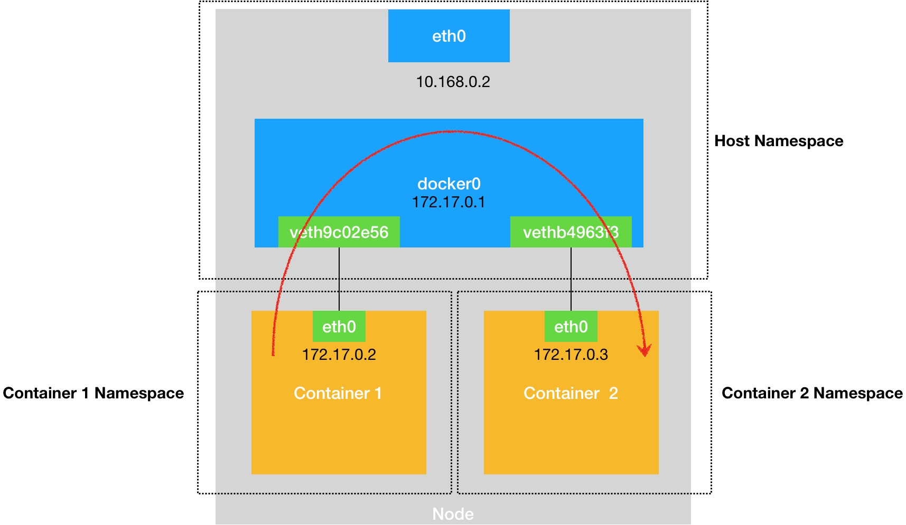
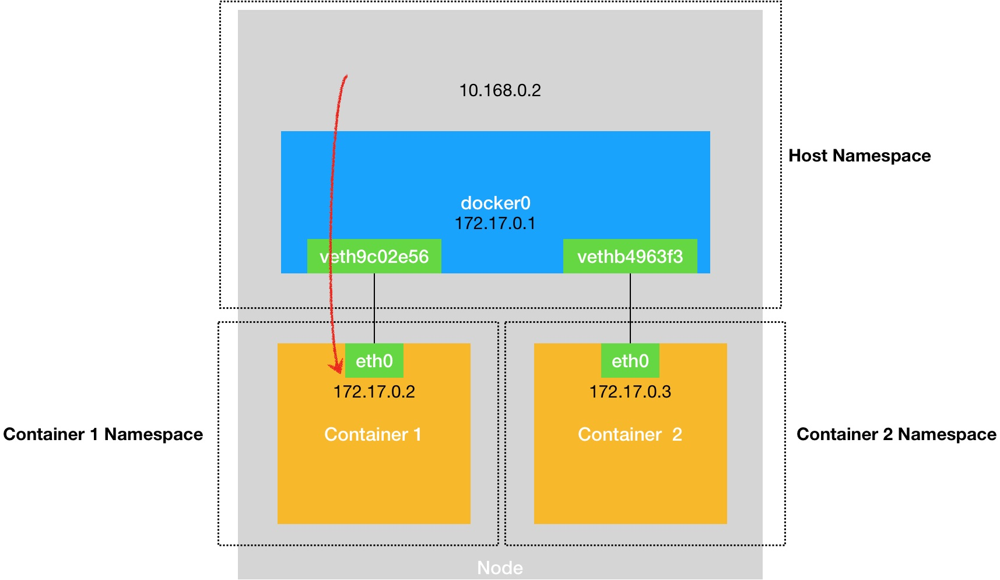
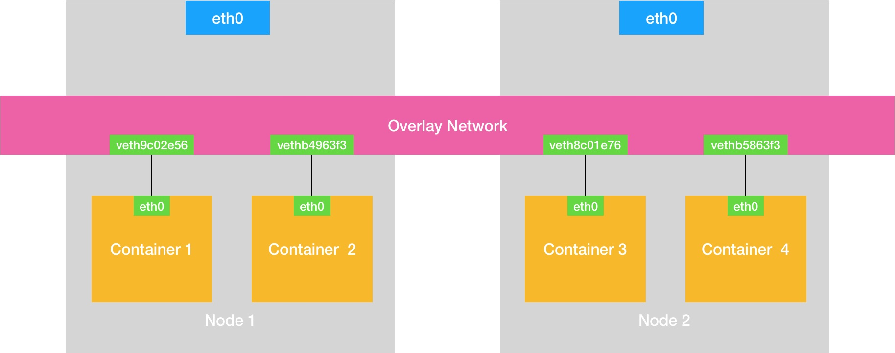

# 浅谈容器网络

​	可以先阅读这篇[文章](https://www.cnblogs.com/ZhuChangwu/p/15512039.html)，讲的还是很不错的。

​	在前面讲解容器基础时，我曾经提到过一个 Linux 容器能看见的“网络栈”，实际上是被隔离在它自己的 Network Namespace 当中的。

​	而所谓“网络栈”，就包括了：网卡（Network Interface）、回环设备（Loopback Device）、路由表（Routing Table）和 iptables 规则。对于一个进程来说，这些要素，其实就构成了它发起和响应网络请求的基本环境。

​	需要指出的是，作为一个容器，它可以声明直接使用宿主机的网络栈（–net=host），即：不开启 Network Namespace，比如：

```shell
$ docker run –d –net=host --name nginx-host nginx
```

​	在这种情况下，这个容器启动后，直接监听的就是宿主机的 80 端口。

​	像这样直接使用宿主机网络栈的方式，虽然可以为容器提供良好的网络性能，但也会不可避免地引入共享网络资源的问题，比如端口冲突。所以，**在大多数情况下，我们都希望容器进程能使用自己 Network Namespace 里的网络栈，即：拥有属于自己的 IP 地址和端口。**

​	这时候，一个显而易见的问题就是：这个被隔离的容器进程，该如何跟其他 Network Namespace 里的容器进程进行交互呢？

​	为了理解这个问题，你其实可以把每一个容器看做一台主机，它们都有一套独立的“网络栈”。

​	如果你想要实现两台主机之间的通信，最直接的办法，就是把它们用一根网线连接起来；而如果你想要实现多台主机之间的通信，那就需要用网线，把它们连接在一台交换机上。

​	在 Linux 中，能够起到虚拟交换机作用的网络设备，是网桥（Bridge）。它是一个工作在数据链路层（Data Link）的设备，主要功能是根据 MAC 地址学习来将数据包转发到网桥的不同端口（Port）上。

​	当然，至于为什么这些主机之间需要 MAC 地址才能进行通信，这就是网络分层模型的基础知识了。不熟悉这块内容的读者，可以通过这篇[文章](https://www.cnblogs.com/ZhuChangwu/p/15183365.html)来学习一下。

​	而为了实现上述目的，Docker 项目会默认在宿主机上创建一个名叫 docker0 的网桥，凡是连接在 docker0 网桥上的容器，就可以通过它来进行通信。

​	可是，我们又该如何把这些容器“连接”到 docker0 网桥上呢？

​	这时候，我们就需要使用一种名叫 **Veth Pair** 的虚拟设备了。

​	Veth Pair 设备的特点是：它被创建出来后，总是以两张虚拟网卡（Veth Peer）的形式成对出现的。并且，从其中一个“网卡”发出的数据包，可以直接出现在与它对应的另一张“网卡”上，哪怕这两个“网卡”在不同的 Network Namespace 里。

​	这就使得 Veth Pair 常常被用作连接不同 Network Namespace 的“网线”。比如，现在我们启动了一个叫作 nginx-1 的容器：

```shell
$ docker run –d --name nginx-1 nginx
```

​	然后进入到这个容器中查看一下它的网络设备：

```shell
# 在宿主机上
$ docker exec -it nginx-1 /bin/bash
# 在容器里
root@2b3c181aecf1:/# ifconfig
eth0: flags=4163<UP,BROADCAST,RUNNING,MULTICAST>  mtu 1500
        inet 172.17.0.2  netmask 255.255.0.0  broadcast 0.0.0.0
        inet6 fe80::42:acff:fe11:2  prefixlen 64  scopeid 0x20<link>
        ether 02:42:ac:11:00:02  txqueuelen 0  (Ethernet)
        RX packets 364  bytes 8137175 (7.7 MiB)
        RX errors 0  dropped 0  overruns 0  frame 0
        TX packets 281  bytes 21161 (20.6 KiB)
        TX errors 0  dropped 0 overruns 0  carrier 0  collisions 0
        
lo: flags=73<UP,LOOPBACK,RUNNING>  mtu 65536
        inet 127.0.0.1  netmask 255.0.0.0
        inet6 ::1  prefixlen 128  scopeid 0x10<host>
        loop  txqueuelen 1000  (Local Loopback)
        RX packets 0  bytes 0 (0.0 B)
        RX errors 0  dropped 0  overruns 0  frame 0
        TX packets 0  bytes 0 (0.0 B)
        TX errors 0  dropped 0 overruns 0  carrier 0  collisions 0
        
$ route
Kernel IP routing table
Destination     Gateway         Genmask         Flags Metric Ref    Use Iface
default         172.17.0.1      0.0.0.0         UG    0      0        0 eth0
172.17.0.0      0.0.0.0         255.255.0.0     U     0      0        0 eth0
```

​	可以看到，这个容器里有一张叫作 eth0 的网卡，它正是一个 Veth Pair 设备在容器里的这一端。

​	通过 `route` 命令查看 nginx-1 容器的路由表，我们可以看到，这个 eth0 网卡是这个容器里的默认路由设备；所有对 172.17.0.0/16 网段的请求，也会被交给 eth0 来处理（第二条 172.17.0.0 路由规则）。

​	而这个 Veth Pair 设备的另一端，则在宿主机上。你可以通过查看宿主机的网络设备看到它，如下所示：

```shell
# 在宿主机上
$ ifconfig
...
docker0   Link encap:Ethernet  HWaddr 02:42:d8:e4:df:c1  
          inet addr:172.17.0.1  Bcast:0.0.0.0  Mask:255.255.0.0
          inet6 addr: fe80::42:d8ff:fee4:dfc1/64 Scope:Link
          UP BROADCAST RUNNING MULTICAST  MTU:1500  Metric:1
          RX packets:309 errors:0 dropped:0 overruns:0 frame:0
          TX packets:372 errors:0 dropped:0 overruns:0 carrier:0
 collisions:0 txqueuelen:0 
          RX bytes:18944 (18.9 KB)  TX bytes:8137789 (8.1 MB)
veth9c02e56 Link encap:Ethernet  HWaddr 52:81:0b:24:3d:da  
          inet6 addr: fe80::5081:bff:fe24:3dda/64 Scope:Link
          UP BROADCAST RUNNING MULTICAST  MTU:1500  Metric:1
          RX packets:288 errors:0 dropped:0 overruns:0 frame:0
          TX packets:371 errors:0 dropped:0 overruns:0 carrier:0
 collisions:0 txqueuelen:0 
          RX bytes:21608 (21.6 KB)  TX bytes:8137719 (8.1 MB)
          
$ brctl show
bridge name bridge id  STP enabled interfaces
docker0  8000.0242d8e4dfc1 no  veth9c02e56
```

​	通过 `ifconfig` 命令的输出，你可以看到，nginx-1 容器对应的 Veth Pair 设备，在宿主机上是一张虚拟网卡。它的名字叫作 veth9c02e56。并且，通过 `brctl show` 的输出，你可以看到这张网卡被“插”在了 docker0 上。

​	这时候，如果我们再在这台宿主机上启动另一个 Docker 容器，比如 nginx-2：

```shell
$ docker run –d --name nginx-2 nginx
$ brctl show
bridge name bridge id  STP enabled interfaces
docker0  8000.0242d8e4dfc1 no  veth9c02e56
       vethb4963f3
```

​	你就会发现一个新的、名叫 vethb4963f3 的虚拟网卡，也被“插”在了 docker0 网桥上。

​	这时候，如果你在 nginx-1 容器里 ping 一下 nginx-2 容器的 IP 地址（172.17.0.3），就会发现同一宿主机上的两个容器默认就是相互连通的。

​	这其中的原理其实非常简单，我来解释一下。

​	当你在 nginx-1 容器里访问 nginx-2 容器的 IP 地址（比如 ping 172.17.0.3）的时候，这个目的 IP 地址会匹配到 nginx-1 容器里的第二条路由规则。可以看到，这条路由规则的网关（Gateway）是 0.0.0.0，这就意味着这是一条直连规则，即：凡是匹配到这条规则的 IP 包，应该经过本机的 eth0 网卡，通过二层网络直接发往目的主机。

​	而要通过二层网络到达 nginx-2 容器，就需要有 172.17.0.3 这个 IP 地址对应的 MAC 地址。所以 nginx-1 容器的网络协议栈，就需要通过 eth0 网卡发送一个 ARP 广播，来通过 IP 地址查找对应的 MAC 地址。**备注：ARP（Address Resolution Protocol），是通过三层的 IP 地址找到对应的二层 MAC 地址的协议。**

​	我们前面提到过，这个 eth0 网卡，是一个 Veth Pair，它的一端在这个 nginx-1 容器的 Network Namespace 里，而另一端则位于宿主机上（Host Namespace），并且被“插”在了宿主机的 docker0 网桥上。

​	一旦一张虚拟网卡被“插”在网桥上，它就会变成该网桥的“从设备”。从设备会被“剥夺”调用网络协议栈处理数据包的资格，从而“降级”成为网桥上的一个端口。而这个端口唯一的作用，就是接收流入的数据包，然后把这些数据包的“生杀大权”（比如转发或者丢弃），全部交给对应的网桥。

​	所以，在收到这些 ARP 请求之后，docker0 网桥就会扮演二层交换机的角色，把 ARP 广播转发到其他被“插”在 docker0 上的虚拟网卡上。这样，同样连接在 docker0 上的 nginx-2 容器的网络协议栈就会收到这个 ARP 请求，从而将 172.17.0.3 所对应的 MAC 地址回复给 nginx-1 容器。

​	有了这个目的 MAC 地址，nginx-1 容器的 eth0 网卡就可以将数据包发出去。而根据 Veth Pair 设备的原理，这个数据包会立刻出现在宿主机上的 veth9c02e56 虚拟网卡上。不过，此时这个 veth9c02e56 网卡的网络协议栈的资格已经被“剥夺”，所以这个数据包就直接流入到了 docker0 网桥里。

​	docker0 处理转发的过程，则继续扮演二层交换机的角色。此时，docker0 网桥根据数据包的目的 MAC 地址（也就是 nginx-2 容器的 MAC 地址），在它的 CAM 表（即交换机通过 MAC 地址学习维护的端口和 MAC 地址的对应表）里查到对应的端口（Port）为：vethb4963f3，然后把数据包发往这个端口。

​	而这个端口，正是 nginx-2 容器“插”在 docker0 网桥上的另一块虚拟网卡，当然，它也是一个 Veth Pair 设备。这样，数据包就进入到了 nginx-2 容器的 Network Namespace 里。

​	所以，nginx-2 容器看到的情况是，它自己的 eth0 网卡上出现了流入的数据包。这样，nginx-2 的网络协议栈就会对请求进行处理，最后将响应（Pong）返回到 nginx-1。

​	以上，就是同一个宿主机上的不同容器通过 docker0 网桥进行通信的流程了。我把这个流程总结成了一幅示意图，如下所示：



​	需要注意的是，在实际的数据传递时，上述数据的传递过程在网络协议栈的不同层次，都有 Linux 内核 Netfilter 参与其中。所以，如果感兴趣的话，你可以通过打开 iptables 的 TRACE 功能查看到数据包的传输过程，具体方法如下所示：

```shell
# 在宿主机上执行
$ iptables -t raw -A OUTPUT -p icmp -j TRACE
$ iptables -t raw -A PREROUTING -p icmp -j TRACE
```

​	通过上述设置，你就可以在 /var/log/syslog 里看到数据包传输的日志了。这一部分内容，你可以在课后结合iptables 的相关知识进行实践，或者查看该[视频](https://www.bilibili.com/video/BV1nL411j7Ln?spm_id_from=333.999.0.0&vd_source=f4423986cf76dd8d17c7490655b0ea80)从而验证我和你分享的数据包传递流程。

​	熟悉了 docker0 网桥的工作方式，你就可以理解，在默认情况下，被限制在 Network Namespace 里的容器进程，实际上是通过 Veth Pair 设备 + 宿主机网桥的方式，实现了跟同其他容器的数据交换。

​	与之类似地，当你在一台宿主机上，访问该宿主机上的容器的 IP 地址时，这个请求的数据包，也是先根据路由规则到达 docker0 网桥，然后被转发到对应的 Veth Pair 设备，最后出现在容器里。这个过程的示意图，如下所示：



​	同样地，当一个容器试图连接到另外一个宿主机时，比如：ping 10.168.0.3，它发出的请求数据包，首先经过 docker0 网桥出现在宿主机上。然后根据宿主机的路由表里的直连路由规则（10.168.0.0/24 via eth0)），对 10.168.0.3 的访问请求就会交给宿主机的 eth0 处理。

​	所以接下来，这个数据包就会经宿主机的 eth0 网卡转发到宿主机网络上，最终到达 10.168.0.3 对应的宿主机上。当然，这个过程的实现要求这两台宿主机本身是连通的。这个过程的示意图，如下所示：


​	所以说，当你遇到容器连不通“外网”的时候，你都应该先试试 docker0 网桥能不能 ping 通，然后查看一下跟 docker0 和 Veth Pair 设备相关的 iptables 规则是不是有异常，往往就能够找到问题的答案了。

​	不过，在最后一个“Docker 容器连接其他宿主机”的例子里，你可能已经联想到了这样一个问题：如果在另外一台宿主机（比如：10.168.0.3）上，也有一个 Docker 容器。那么，我们的 nginx-1 容器又该如何访问它呢？

​	这个问题，其实就是容器的“跨主通信”问题。

​	在 Docker 的默认配置下，一台宿主机上的 docker0 网桥，和其他宿主机上的 docker0 网桥，没有任何关联，它们互相之间也没办法连通。所以，连接在这些网桥上的容器，自然也没办法进行通信了。

​	不过，万变不离其宗。

​	如果我们通过软件的方式，创建一个整个集群“公用”的网桥，然后把集群里的所有容器都连接到这个网桥上，不就可以相互通信了吗？

​	说得没错。这样一来，我们整个集群里的容器网络就会类似于下图所示的样子：



​	可以看到，构建这种容器网络的核心在于：我们需要在已有的宿主机网络上，再通过软件构建一个覆盖在已有宿主机网络之上的、可以把所有容器连通在一起的虚拟网络。所以，这种技术就被称为：Overlay Network（覆盖网络）。

​	而这个 Overlay Network 本身，可以由每台宿主机上的一个“特殊网桥”共同组成。比如，当 Node 1 上的 Container 1 要访问 Node 2 上的 Container 3 的时候，Node 1 上的“特殊网桥”在收到数据包之后，能够通过某种方式，把数据包发送到正确的宿主机，比如 Node 2 上。而 Node 2 上的“特殊网桥”在收到数据包后，也能够通过某种方式，把数据包转发给正确的容器，比如 Container 3。

​	甚至，每台宿主机上，都不需要有一个这种特殊的网桥，而仅仅通过某种方式配置宿主机的路由表，就能够把数据包转发到正确的宿主机上。这些内容，我在后面的文章中会为你一一讲述。


## 总结

​	在今天这篇文章中，我主要为你介绍了在本地环境下，单机容器网络的实现原理和 docker0 网桥的作用。

​	这里的关键在于，容器要想跟外界进行通信，它发出的 IP 包就必须从它的 Network Namespace 里出来，来到宿主机上。

​	而解决这个问题的方法就是：为容器创建一个一端在容器里充当默认网卡、另一端在宿主机上的 Veth Pair 设备。

​	上述单机容器网络的知识，是后面我们讲解多机容器网络的重要基础，请务必认真消化理解。