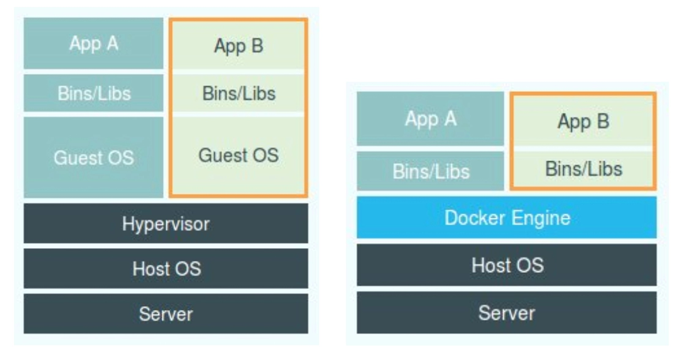

# 白话容器基础（二）：隔离与限制



​	在之前虚拟机与容器技术的对比图里，不应该把 Docker Engine 或者任何容器管理工具放在跟 Hypervisor 相同的位置，因为它们并不像 Hypervisor 那样对应用进程的隔离环境负责，也不会创建任何实体的“容器”，真正对隔离环境负责的是宿主机操作系统本身：所以，在这个对比图里，我们应该把 Docker 画在跟应用同级别并且靠边的位置。这意味着，用户运行在容器里的应用进程，跟宿主机上的其他进程一样，都由宿主机操作系统统一管理，只不过这些被隔离的进程拥有额外设置过的 Namespace 参数。而 Docker 项目在这里扮演的角色，更多的是旁路式的辅助和管理工作。

​	**“敏捷”和“高性能”是容器相较于虚拟机最大的优势，也是它能够在 PaaS 这种更细粒度的资源管理平台上大行其道的重要原因。**

​	不过，有利就有弊，基于 Linux Namespace 的隔离机制相比于虚拟化技术也有很多不足之处，其中最主要的问题就是：**隔离得不彻底**。

​	首先，既然容器只是运行在宿主机上的一种特殊的进程，那么多个容器之间使用的就还是同一个宿主机的操作系统内核。

​	尽管你可以在容器里通过 Mount Namespace 单独挂载其他不同版本的操作系统文件，比如 CentOS 或者 Ubuntu，但这并不能改变共享宿主机内核的事实。这意味着，如果你要在 Windows 宿主机上运行 Linux 容器，或者在低版本的 Linux 宿主机上运行高版本的 Linux 容器，都是行不通的。

​	而相比之下，拥有硬件虚拟化技术和独立 Guest OS 的虚拟机就要方便得多了。最极端的例子是，Microsoft 的云计算平台 Azure，实际上就是运行在 Windows 服务器集群上的，但这并不妨碍你在它上面创建各种 Linux 虚拟机出来。

​	**其次，在 Linux 内核中，有很多资源和对象是不能被 Namespace 化的，最典型的例子就是：时间。**

​	这就意味着，如果你的容器中的程序使用 settimeofday(2) 系统调用修改了时间，整个宿主机的时间都会被随之修改，这显然不符合用户的预期。相比于在虚拟机里面可以随便折腾的自由度，在容器里部署应用的时候，“什么能做，什么不能做”，就是用户必须考虑的一个问题。

​	此外，由于上述问题，尤其是共享宿主机内核的事实，容器给应用暴露出来的攻击面是相当大的，应用“越狱”的难度自然也比虚拟机低得多。

​	更为棘手的是，尽管在实践中我们确实可以使用 Seccomp 等技术，对容器内部发起的所有系统调用进行过滤和甄别来进行安全加固，但这种方法因为多了一层对系统调用的过滤，必然会拖累容器的性能。何况，默认情况下，谁也不知道到底该开启哪些系统调用，禁止哪些系统调用。

​	所以，在生产环境中，没有人敢把运行在物理机上的 Linux 容器直接暴露到公网上。当然，我后续会讲到的基于虚拟化或者独立内核技术的容器实现，则可以比较好地在隔离与性能之间做出平衡。

=======================================================================

​	**在介绍完容器的“隔离”技术之后，我们再来研究一下容器的“限制”问题。**

​	也许你会好奇，我们不是已经通过 Linux Namespace 创建了一个“容器”吗，为什么还需要对容器做“限制”呢？

​	我还是以 PID Namespace 为例，来给你解释这个问题。虽然容器内的第 1 号进程在“障眼法”的干扰下只能看到容器里的情况，但是宿主机上，它作为第 100 号进程与其他所有进程之间依然是平等的竞争关系。这就意味着，虽然第 100 号进程表面上被隔离了起来，但是它所能够使用到的资源（比如 CPU、内存），却是可以随时被宿主机上的其他进程（或者其他容器）占用的。当然，这个 100 号进程自己也可能把所有资源吃光。这些情况，显然都不是一个“沙盒”应该表现出来的合理行为。 

​	Linux Cgroups 就是 Linux 内核中用来为进程设置资源限制的一个重要功能。Linux Cgroups 的全称是 Linux Control Groups。它最主要的作用，就是限制一个进程组能够使用的资源上限，包括 CPU、内存、磁盘、网络带宽等等。此外，Cgroups 还能够对进程进行优先级设置、审计，以及将进程挂起和恢复等操作。这里只和你重点探讨它与容器关系最紧密的“限制”能力，并通过一组实践来带你认识一下 Cgroups。

​	在 /sys/fs/cgroup 下面有很多诸如 cpuset、cpu、 memory 这样的子目录，也叫子系统。这些都是我这台机器当前可以被 Cgroups 进行限制的资源种类。而在子系统对应的资源种类下，你就可以看到该类资源具体可以被限制的方法。比如，对 CPU 子系统来说，我们就可以看到如下几个配置文件，这个指令是：

```shell
$ ls /sys/fs/cgroup/cpu
cgroup.clone_children   cpu.cfs_period_us   cpu.rt_period_us    cpu.shares   notify_on_release
cgroup.procs      cpu.cfs_quota_us  cpu.rt_runtime_us cpu.stat  tasks
```

​	如果熟悉 Linux CPU 管理的话，你就会在它的输出里注意到 cfs_period 和 cfs_quota 这样的关键词。这两个参数需要组合使用，可以用来限制进程在长度为 cfs_period 的一段时间内，只能被分配到总量为 cfs_quota 的 CPU 时间。cgroup.procs和tasks中存放的是该进程组的进程号

​	而这样的配置文件又如何使用呢？你需要在对应的子系统下面创建一个目录，比如，我们现在进入 /sys/fs/cgroup/cpu 目录下：

```shell
root@ubuntu:/sys/fs/cgroup/cpu$ mkdir container
root@ubuntu:/sys/fs/cgroup/cpu$ ls container/
cgroup.clone_children cpu.cfs_period_us cpu.rt_period_us  cpu.shares notify_on_release
cgroup.procs      cpu.cfs_quota_us  cpu.rt_runtime_us cpu.stat  tasks
```

​	这个目录就称为一个“控制组”。你会发现，操作系统会在你新创建的 container 目录下，自动生成该子系统对应的资源限制文件。现在，我们在后台执行这样一条脚本：

```shell
$ while : ; do : ; done &
[1] 226
```

​	显然，它执行了一个死循环，可以把计算机的 CPU 吃到 100%，根据它的输出，我们可以看到这个脚本在后台运行的进程号（PID）是 226。这样，我们可以用 top 指令来确认一下 CPU 有没有被打满：

```shell
$ top
%Cpu0 :100.0 us, 0.0 sy, 0.0 ni, 0.0 id, 0.0 wa, 0.0 hi, 0.0 si, 0.0 st
```

​	在输出里可以看到，CPU 的使用率已经 100% 了（%Cpu0 :100.0 us）。而此时，我们可以通过查看 container 目录下的文件，看到 container 控制组里的 CPU quota 还没有任何限制（即：-1），CPU period 则是默认的 100 ms（100000 us）：

```shell
$ cat /sys/fs/cgroup/cpu/container/cpu.cfs_quota_us 
-1
$ cat /sys/fs/cgroup/cpu/container/cpu.cfs_period_us 
100000
```

​	接下来，我们可以通过修改这些文件的内容来设置限制。比如，向 container 组里的 cfs_quota 文件写入 20 ms（20000 us）：

```shell
$ echo 20000 > /sys/fs/cgroup/cpu/container/cpu.cfs_quota_us
```

​	结合前面的介绍，你应该能明白这个操作的含义，它意味着在每 100 ms 的时间里，被该控制组限制的进程只能使用 20 ms 的 CPU 时间，也就是说这个进程只能使用到 20% 的 CPU 带宽。

​	接下来，我们把被限制的进程的 PID 写入 container 组里的 tasks 文件，上面的设置就会对该进程生效了：

```shell
$ echo 226 > /sys/fs/cgroup/cpu/container/tasks 
```

​	我们可以用 top 指令查看一下：

```shell
$ top
%Cpu0 : 20.3 us, 0.0 sy, 0.0 ni, 79.7 id, 0.0 wa, 0.0 hi, 0.0 si, 0.0 st
```

​	可以看到，计算机的 CPU 使用率立刻降到了 20%（%Cpu0 : 20.3 us）。

​	**关于CPU控制还有一个重要的属性，即cpu.shares，用于控制多个进程组之间可使用CPU的比例，如存在进程组test1和test2，其shares分别设置为3和7，则表示进程组test1中的所有进程能够使用的CPU时间的总和对比于test2为3比7。**

​	除 CPU 子系统外，Cgroups 的每一个子系统都有其独有的资源限制能力，比如：

- blkio，为块设备设定I/O 限制，一般用于磁盘等设备；

- cpuset，为进程分配单独的 CPU 核和对应的内存节点；

- memory，为进程设定内存使用的限制；

  编写程序，分配600M内存

  ```c
  #include<stdio.h>
  #include<stdlib.h>
  #include<string.h>
  
  #define CHUNK_SIZE 1024 * 1024 * 100
  
  int main()
  {
      char *p;
      int i;
  
      for(i = 0; i < 6; i ++)
      {
          p = malloc(CHUNK_SIZE);
          if(p == NULL)
          {
              printf("malloc error!");
              return 0;
          }
          memset(p, 0, CHUNK_SIZE);
          printf("malloc memory %d MB\n", (i + 1) * 100);
          sleep(5);
      }
      while(1)
      {
          sleep(1);
      }
     return 0;
  }
  
  ```

  添加cgroup限制

  ```shell
  [root@localhost ~]# mkdir -p /sys/fs/cgroup/memory/memory-test
  [root@localhost ~]#  cat /sys/fs/cgroup/memory/memory-test/memory.limit_in_bytes
  9223372036854771712
  # 设置最大内存大小为200M
  [root@localhost ~]# echo 209715200 > /sys/fs/cgroup/memory/memory-test/memory.limit_in_bytes 
  [root@localhost ~]# cat /sys/fs/cgroup/memory/memory-test/memory.limit_in_bytes 
  209715200
  #为了避免受swap空间的影响，设置swappiness为0来禁止当前cgroup使用swap
  [root@localhost ~]# echo 0 > /sys/fs/cgroup/memory/memory-test/memory.swappiness
  
  
  ```

  启动程序，并将程序加入cgroup

  ```shell
  [root@localhost ~]# ./mem 
  
  #另一个shell执行
  [root@localhost ~]# echo `ps -ef | grep mem | grep -v grep | awk '{print $2}'` > /sys/fs/cgroup/memory/memory-test/tasks
  
  [root@localhost ~]# ./mem 
  malloc memory 100 MB
  malloc memory 200 MB
  Killed
  
  #通过设置memory.oom_disable的值来设置内存超出设定值时是操作系统kill进程还是休眠进程。
  # mem内存超过200M时进程会休眠
  echo 1 > /sys/fs/cgroup/memory/memory-test/memory.oom_control
  
  
  ```

  

- cpuacct，自动生成报告统计控制组所使用的CPU资源

​	**Linux Cgroups 的设计还是比较易用的，简单粗暴地理解呢，它就是一个子系统目录加上一组资源限制文件的组合**。而对于 Docker 等 Linux 容器项目来说，它们只需要在每个子系统下面，为每个容器创建一个控制组（即创建一个新目录），然后在启动容器进程之后，把这个进程的 PID 填写到对应控制组的 tasks 文件中就可以了。

​	而至于在这些控制组下面的资源文件里填上什么值，就靠用户执行 docker run 时的参数指定了，比如这样一条命令：

```shell
$ docker run -it --cpu-period=100000 --cpu-quota=20000 ubuntu /bin/bash
```


## 总结

​	容器是一个“单进程”模型。

​	**由于一个容器的本质就是一个进程，用户的应用进程实际上就是容器里 PID=1 的进程，也是其他后续创建的所有进程的父进程。这就意味着，在一个容器中，你没办法同时运行两个不同的应用，除非你能事先找到一个公共的 PID=1 的程序来充当两个不同应用的父进程，这也是为什么很多人都会用 systemd 或者 supervisord 这样的软件来代替应用本身作为容器的启动进程。**

​	**但是，在后面分享容器设计模式时，我还会推荐其他更好的解决办法。这是因为容器本身的设计，就是希望容器和应用能够同生命周期，这个概念对后续的容器编排非常重要。否则，一旦出现类似于“容器是正常运行的，但是里面的应用早已经挂了”的情况，编排系统处理起来就非常麻烦了。**

​	另外，跟 Namespace 的情况类似，Cgroups 对资源的限制能力也有很多不完善的地方，被提及最多的自然是 /proc 文件系统的问题。

​	**众所周知，Linux 下的 /proc 目录存储的是记录当前内核运行状态的一系列特殊文件，该目录实际是存储在内存中的，只不过被Linux系统映射成了目录，让用户可以直接访问。用户可以通过访问这些文件，查看系统以及当前正在运行的进程的信息，比如 CPU 使用情况、内存占用率等，这些文件也是 top 指令查看系统信息的主要数据来源。**

​	但是，你如果在容器里执行 top 指令，就会发现，它显示的信息居然是宿主机的 CPU 和内存数据，而不是当前容器的数据。

​	造成这个问题的原因就是，/proc 文件系统并不知道用户通过 Cgroups 给这个容器做了什么样的资源限制，即：/proc 文件系统不了解 Cgroups 限制的存在。

​	在生产环境中，这个问题必须进行修正，否则应用程序在容器里读取到的 CPU 核数、可用内存等信息都是宿主机上的数据，这会给应用的运行带来非常大的困惑和风险。这也是在企业中，容器化应用碰到的一个常见问题，也是容器相较于虚拟机另一个不尽如人意的地方。

> `/sys/fs/cgroup`目录是宿主机上的一个虚拟文件系统，用于管理cgroup资源。**在容器内部，可以通过`/proc/self/cgroup`文件查看容器的cgroup路径。**

## 思考题：

​	1、你是否知道如何修复容器中的 top 指令以及 /proc 文件系统中的信息呢？（提示：lxcfs）

​	2、在从虚拟机向容器环境迁移应用的过程中，你还遇到哪些容器与虚拟机的不一致问题？

​	Answer for 1：/proc文件系统的问题我好像遇到过这个坑..当时在容器上运行的java应用，由于当时jvm参数没正确配置上，就用默认的，而容器设置的内存为4g，最后oom了，当时用命令查看容器的内存占用情况，竟然发现内存竟然有60多g。 那应该显示的是宿主机的内存了，jvm按照宿主机内存大小分配的默认内存应该大于4g 所以还没full gc 就oom了。

​	https://blog.csdn.net/weixin_52990636/article/details/121976031

​	Answer for 1：top 是从 /proc目录中获取数据，所以道理上来讲，容器不挂载宿主机的该目录就可以了。lxcfs就是来实现这个功能的，做法是把宿主机的 /var/lib/lxcfs/proc/memoinfo 文件挂载到Docker容器的/proc/meminfo位置后。容器中进程读取相应文件内容时，LXCFS的FUSE实现会从容器对应的Cgroup中读取正确的内存限制。从而使得应用获得正确的资源约束设定。kubernetes环境下，也能用，以ds 方式运行 lxcfs ，自动给容器注入正确的 proc 信息。


## 附：nsenter命令

​	可以通过该命令进到Docker容器的某个namespace下，并且执行相关命令（可以执行容器中没有的命令，只要该命令在宿主机中有即可）

​	参考：https://blog.csdn.net/qq_35745940/article/details/119900634

​			  [一种进入Pod容器网络的方法](https://blog.csdn.net/NUCEMLS/article/details/124231364?spm=1001.2014.3001.5502)

