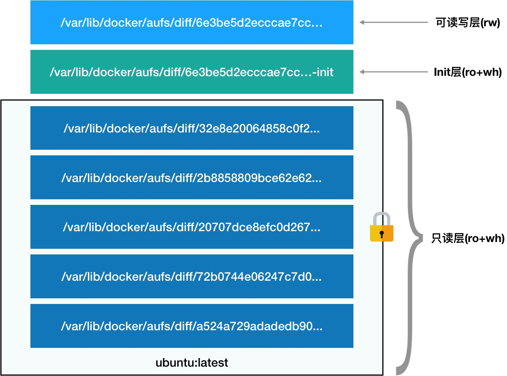

# 白话容器基础（三）：深入理解容器镜像

​	思路：先引入一个问题，容器里的进程看到的文件系统是什么样子？之后通过简单的小代码展示了可以通过Mount namespace挂载目录，但是默认会继承宿主机的目录，所以需要重新挂载需要挂载的目录。之后就想到可以把容器进程的/根目录通过chroot命令挂载到我们自己预先准备的目录上（比如ubuntu的iso文件系统等等），专业名叫rootfs（根文件系统），也就是所谓的“容器镜像”。之后由此引入Docker镜像的分层设计。

------

​	容器里的进程看到的文件系统又是什么样子的呢？

​	可能你立刻就能想到，这一定是一个关于 Mount Namespace 的问题：容器里的应用进程，理应看到一份完全独立的文件系统。这样，它就可以在自己的容器目录（比如 /tmp）下进行操作，而完全不会受宿主机以及其他容器的影响。

​	通过简单的实验发现，我们启用Mount Namespace后，容器进程的/tmp就是宿主机的/tmp目录。经分析发现，Mount Namespace 修改的，是容器进程对文件系统“挂载点”的认知。但是，这也就意味着，只有在“挂载”这个操作发生之后，进程的视图才会被改变。而在此之前，新创建的容器会直接继承宿主机的各个挂载点。

​	所以在实验中，我们可以在创建新进程时，除了声明要启用 Mount Namespace 之外，我们还可以告诉容器进程，有哪些目录需要重新挂载，就比如这个 /tmp 目录。于是，我们在容器进程执行前可以添加一步重新挂载 /tmp 目录的操作：

```c++
int container_main(void* arg)
{
  printf("Container - inside the container!\n");
  // 如果你的机器的根目录的挂载类型是shared，那必须先重新挂载根目录
  // mount("", "/", NULL, MS_PRIVATE, "");
  mount("none", "/tmp", "tmpfs", 0, "");
  execv(container_args[0], container_args);
  printf("Something's wrong!\n");
  return 1;
}
```

​	可以看到，在修改后的代码里，我在容器进程启动之前，加上了一句 mount(“none”, “/tmp”, “tmpfs”, 0, “”) 语句。就这样，我告诉了容器以 tmpfs（内存盘）格式，重新挂载了 /tmp 目录。

​	这段修改后的代码，编译执行后的结果又如何呢？我们可以试验一下：

```shell
$ gcc -o ns ns.c
$ ./ns
Parent - start a container!
Container - inside the container!
$ ls /tmp
```

​	可以看到，这次 /tmp 变成了一个空目录，这意味着重新挂载生效了。我们可以用 mount -l 检查一下：

```shell
$ mount -l | grep tmpfs
none on /tmp type tmpfs (rw,relatime)
```

​	可以看到，容器里的 /tmp 目录是以 tmpfs 方式单独挂载的。

​	**更重要的是，因为我们创建的新进程启用了 Mount Namespace，所以这次重新挂载的操作，只在容器进程的 Mount Namespace 中有效。如果在宿主机上用 mount -l 来检查一下这个挂载，你会发现它是不存在的：**

```shell
# 在宿主机上
$ mount -l | grep tmpfs
```

​	**这就是 Mount Namespace 跟其他 Namespace 的使用略有不同的地方：它对容器进程视图的改变，一定是伴随着挂载操作（mount）才能生效。**

​	可是，作为一个普通用户，我们希望的是一个更友好的情况：每当创建一个新容器时，我希望容器进程看到的文件系统就是一个独立的隔离环境，而不是继承自宿主机的文件系统。怎么才能做到这一点呢？不难想到，我们可以在容器进程启动之前重新挂载它的整个根目录“/”。而由于 Mount Namespace 的存在，这个挂载对宿主机不可见，所以容器进程就可以在里面随便折腾了。（chroot）

​	实际上，Mount Namespace 正是基于对 chroot 的不断改良才被发明出来的，它也是 Linux 操作系统里的第一个 Namespace。

​	当然，为了能够让容器的这个根目录看起来更“真实”，我们一般会在这个容器的根目录下挂载一个完整操作系统的文件系统，比如 Ubuntu16.04 的 ISO。这样，在容器启动之后，我们在容器里通过执行 "ls /" 查看根目录下的内容，就是 Ubuntu 16.04 的所有目录和文件。

​	而这个挂载在容器根目录上、用来为容器进程提供隔离后执行环境的文件系统，就是所谓的“容器镜像”。它还有一个更为专业的名字，叫作：rootfs（根文件系统）。

​	所以，一个最常见的 rootfs，或者说容器镜像，会包括如下所示的一些目录和文件，比如 /bin，/etc，/proc 等等。

```shell
$ ls /
bin dev etc home lib lib64 mnt opt proc root run sbin sys tmp usr var
```

​	**而你进入容器之后执行的 /bin/bash，就是 /bin 目录下的可执行文件，与宿主机的 /bin/bash 完全不同。**

​	现在，你应该可以理解，对 Docker 项目来说，它最核心的原理实际上就是为待创建的用户进程：

1. 启用 Linux Namespace 配置；
2. 设置指定的 Cgroups 参数；
3. 切换进程的根目录（Change Root）。

​	这样，一个完整的容器就诞生了。不过，Docker 项目在最后一步的切换上会优先使用 pivot_root 系统调用，如果系统不支持，才会使用 chroot。**这两个系统调用虽然功能类似，但是也有细微的区别。**

​	另外，需要明确的是，rootfs 只是一个操作系统所包含的文件、配置和目录，并不包括操作系统内核。在 Linux 操作系统中，这两部分是分开存放的，操作系统只有在开机启动时才会加载指定版本的内核镜像。所以说，rootfs 只包括了操作系统的“躯壳”，并没有包括操作系统的“灵魂”。

​	那么，对于容器来说，这个操作系统的“灵魂”又在哪里呢？**实际上，同一台机器上的所有容器，都共享宿主机操作系统的内核**。这就意味着，如果你的应用程序需要配置内核参数、加载额外的内核模块，以及跟内核进行直接的交互，你就需要注意了：这些操作和依赖的对象，都是宿主机操作系统的内核，它对于该机器上的所有容器来说是一个“全局变量”，牵一发而动全身。**这也是容器相比于虚拟机的主要缺陷之一：毕竟后者不仅有模拟出来的硬件机器充当沙盒，而且每个沙盒里还运行着一个完整的 Guest OS 给应用随便折腾。**

​	典型的Linux文件系统由bootfs和rootfs两部分组成：

- bootfs(boot file system)主要包含 bootloader和kernel，bootloader主要是引导加载kernel，当kernel被加载到内存中后 bootfs就被umount了，也就是卸载了
  - 传统的Linux加载bootfs时会先将rootfs设为read-only，然后在系统自检之后将rootfs从read-only改为read-write，然后我们就可以在rootfs上进行写和读的操作了。
  - Docker的镜像不是这样，它在bootfs自检完毕之后并不会把rootfs的read-only改为read-write。而是利用union mount（UnionFS的一种挂载机制）将一个或多个read-only的rootfs加载到之前的read-only的rootfs层之上。在加载了这么多层的rootfs之后，仍然让它看起来只像是一个文件系统，在Docker的体系里把union mount的这些read-only的rootfs叫做Docker的镜像。但是，此时的每一层rootfs都是read-only的，我们此时还不能对其进行操作。当我们创建一个容器，也就是将Docker镜像进行实例化，系统会在一层或是多层read-only的rootfs之上分配一层空的read-write的rootfs
- rootfs (root file system) 包含的就是典型 Linux 系统中的/dev，/proc，/bin，/etc等标准目录和文件，对于一个精简的OS，rootfs可以很小，只需要包括最基本的命令、工具和程序库就可以了，因为底层直接用Host的kernel，自己只需要提供 rootfs 就行了。由此可见对于不同的linux发行版, bootfs是一致的, rootfs会有差别, 因此不同的发行版可以公用bootfs

------

​	不过，这时你可能已经发现了另一个非常棘手的问题：难道我每开发一个应用，或者升级一下现有的应用，都要重复制作一次 rootfs 吗？

​	**为此，Docker 公司在实现 Docker 镜像时并没有沿用以前制作 rootfs 的标准流程，而是做了一个小小的创新：在镜像的设计中，引入了层（layer）的概念。也就是说，用户制作镜像的每一步操作，都会生成一个层，也就是一个增量 rootfs。当然，这个想法不是凭空臆造出来的，而是用到了一种叫作联合文件系统（Union File System）的能力。**

​	Union File System 也叫 UnionFS，最主要的功能是将多个不同位置的目录联合挂载（union mount）到同一个目录下。比如，我现在有两个目录 A 和 B，它们分别有两个文件：

```shell
$ tree
.
├── A
│  ├── a
│  └── x
└── B
  ├── b
  └── x
```

​	然后，我使用联合挂载的方式，将这两个目录挂载到一个公共的目录 C 上：

```shell
$ mkdir C
$ mount -t aufs -o dirs=./A:./B none ./C
```

​	这时，我再查看目录 C 的内容，就能看到目录 A 和 B 下的文件被合并到了一起：

```shell
$ tree ./C
./C
├── a
├── b
└── x
```

​	可以看到，在这个合并后的目录 C 里，有 a、b、x 三个文件，并且 x 文件只有一份。这，就是“合并”的含义。此外，如果你在目录 C 里对 a、b、x 文件做修改，这些修改也会在对应的目录 A、B 中生效。

​	新版本的Docker 镜像层是在：/var/lib/docker/overlay2/id/diff 

​	**新版Docker在Centos7和Ubuntu20下，在/var/lib/docker/overlay2/<layer_id>/diff 目录下可以查到镜像每一层的目录，其中layer_id 可以通过docker image inspect [image_name] 查到**

​	运行容器时,这些镜像层是挂载在/var/lib/docker/overlay2/id/merged下的

​	**新版Docker在Centos7和Ubuntu20下，在/var/lib/docker/overlay2/<contianer_id>/merged 下，这个就是容器的挂载点。 id可以使用docker inspect <contianer_id> 查到，df -h 也可以查到**



​	上图环境是 Ubuntu 16.04 和 Docker CE 18.05，这对组合默认使用的是 AuFS 这个联合文件系统的实现。在该环境下，镜像的层都放置在 /var/lib/docker/aufs/diff 目录下，然后被联合挂载在 /var/lib/docker/aufs/mnt 里面。这里只是为了演示只读层、Init层和可读写层。

## 第一部分，只读层（ro+wh）

​	它是这个容器的 rootfs 最下面的五层，对应的正是 ubuntu:latest 镜像的五层。可以看到，它们的挂载方式都是只读的（ro+wh，即 readonly+whiteout，至于什么是 whiteout，我下面马上会讲到）。

​	这时，我们可以分别查看一下这些层的内容：

```shell
$ ls /var/lib/docker/aufs/diff/72b0744e06247c7d0...
etc sbin usr var
$ ls /var/lib/docker/aufs/diff/32e8e20064858c0f2...
run
$ ls /var/lib/docker/aufs/diff/a524a729adadedb900...
bin boot dev etc home lib lib64 media mnt opt proc root run sbin srv sys tmp usr var
```

​	可以看到，这些层，都以增量的方式分别包含了 Ubuntu 操作系统的一部分。

## 第二部分，可读写层

​	它是这个容器的 rootfs 最上面的一层（6e3be5d2ecccae7cc），它的挂载方式为：rw，即 read write。在没有写入文件之前，这个目录是空的。而一旦在容器里做了写操作，你修改产生的内容就会以增量的方式出现在这个层中。

​	可是，你有没有想到这样一个问题：如果我现在要做的，是删除只读层里的一个文件呢？

​	为了实现这样的删除操作，AuFS 会在可读写层创建一个 whiteout 文件，把只读层里的文件“遮挡”起来。

​	**比如，你要删除只读层里一个名叫 foo 的文件，那么这个删除操作实际上是在可读写层创建了一个名叫.wh.foo 的文件。这样，当这两个层被联合挂载之后，foo 文件就会被.wh.foo 文件“遮挡”起来，“消失”了。这个功能，就是“ro+wh”的挂载方式，即只读 +whiteout 的含义。我喜欢把 whiteout 形象地翻译为：“白障”。**

​	所以，最上面这个可读写层的作用，就是专门用来存放你修改 rootfs 后产生的增量，无论是增、删、改，都发生在这里。而当我们使用完了这个被修改过的容器之后，还可以使用 docker commit 和 push 指令，保存这个被修改过的可读写层，并上传到 Docker Hub 上，供其他人使用；而与此同时，原先的只读层里的内容则不会有任何变化。这，就是增量 rootfs 的好处。

## 第三部分，Init 层

​	它是一个以“-init”结尾的层，夹在只读层和读写层之间。Init 层是 Docker 项目单独生成的一个内部层，专门用来存放 /etc/hosts、/etc/resolv.conf 等信息。

​	需要这样一层的原因是，这些文件本来属于只读的 Ubuntu 镜像的一部分，但是用户往往需要在启动容器时写入一些指定的值比如 hostname，所以就需要在可读写层对它们进行修改。

​	可是，这些修改往往只对当前的容器有效，我们并不希望执行 docker commit 时，把这些信息连同可读写层一起提交掉。

​	所以，Docker 做法是，在修改了这些文件之后，以一个单独的层挂载了出来。而用户执行 docker commit 只会提交可读写层，所以是不包含这些内容的。

​	最终，这 7 个层都被联合挂载到 /var/lib/docker/overlay2/<contianer_id>/merged 目录下，表现为一个完整的 Ubuntu 操作系统供容器使用。

​	


​	使用的ubuntu系统使用docker时没有/var/lib/docker/aufs目录，只有/var/lib/docker/overlay2目录，通过docker inspect命令可以查看到镜像在该目录下生成的各种目录文件， 

- LowerDir：指向镜像层； 
- UpperDir：指向容器层，在容器中创建文件后，文件出现在此目录； 
- MergedDir：容器挂载点 ，lowerdir和upperdir整合起来提供统一的视图给容器，作为根文件系统； 
- WorkDir：用于实现copy_up操作。

​	

​	容器镜像的发明，不仅打通了“开发 - 测试 - 部署”流程的每一个环节，更重要的是：容器镜像将会成为未来软件的主流发布方式。

------

## 思考题

1. 既然容器的 rootfs（比如，Ubuntu 镜像），是以只读方式挂载的，那么又如何在容器里修改 Ubuntu 镜像的内容呢？（提示：Copy-on-Write）

   Answer：

   ​	上面的读写层通常也称为容器层，下面的只读层称为镜像层，所有的增删查改操作都只会作用在容器层，相同的文件上层会覆盖掉下层。知道这一点，就不难理解镜像文件的修改，比如修改一个文件的时候，首先会从上到下查找有没有这个文件，找到，就复制到容器层中，修改，修改的结果就会作用到下层的文件，这种方式也被称为copy-on-write。它表示只在需要写时才去复制，这个是针对已有文件的修改场景。比如基于一个image启动多个Container，如果为每个Container都去分配一个image一样的文件系统，那么将会占用大量的磁盘空间。而CoW技术可以让所有的容器共享image的文件系统，所有数据都从image中读取，只有当要对文件进行写操作时，才从image里把要写的文件复制到自己的文件系统进行修改。所以无论有多少个容器共享同一个image，所做的写操作都是对从image中复制到自己的文件系统中的复本上进行，并不会修改image的源文件，且多个容器操作同一个文件，会在每个容器的文件系统里生成一个副本，每个容器修改的都是自己的副本，相互隔离，相互不影响。使用CoW可以有效的提高磁盘的利用率。

2. 除了 AuFS，你知道 Docker 项目还支持哪些 UnionFS 实现吗？你能说出不同宿主机环境下推荐使用哪种实现吗？

   Answer:

   ​	查了一下，包括但不限于以下这几种：aufs, device mapper, btrfs, overlayfs, vfs, zfs。aufs是ubuntu 常用的，device mapper 是 centos，btrfs 是 SUSE，overlayfs ubuntu 和 centos 都会使用，现在最新的 docker 版本中默认两个系统都是使用的 overlayfs，vfs 和 zfs 常用在 solaris 系统。

3. 有读者反映，咱们重新挂载/tmp目录的实验执行完成后，在宿主机上居然可以看到这个挂载信息。。这是怎么回事呢？实际上，大家自己装的虚拟机，或者云上的虚拟机的根目录，很多都是以share方式的挂载的。这时候，你在容器里做mount也会继承share方式。这样就会把容器内挂载传播到宿主机上。解决这个问题，你可以在重新挂载/tmp之前，在容器内先执行一句：mount(“”, “/“, NULL, MS_PRIVATE, “”) 这样，容器内的根目录就是private挂载的了。

   ​    加了这句也不行，或者我使用 mount --make-private / 命令，先修改根目录的挂载类型，然后用命令 findmnt -o TARGET,PROPAGATION / 查看根目录已经修改成private类型了，再运行ns命令还是不行，依然在另一个跑在宿主机的终端上看到了/tmp的挂载，新的挂载还是传播到宿主机上了 

   ​    解决方法： 突然意识到我的linux系统中/tmp的挂载是独立于根目录的，于是我执行了一个命令 findmnt -o TARGET,PROPAGATION /tmp 发现挂载类型是shared，我晕。我这边的情况应该是改/tmp的挂载点类型为private，而不是根目录的，所以我执行 mount --make-private /tmp 然后查看挂在类型 findmnt -o TARGET,PROPAGATION /tmp，变为private，之后再运行ns，可以了。（做这步前我已经把根目录的挂载类型改回shared了） 

   ​    总结： 应该先查看下自己宿主机的挂载信息cat /proc/mount ，再来判断应该是改哪个挂载点的挂在类型，我的 Linux 发行版是 Centos 7

4. Docker中一个centos镜像为什么只有200M，而一个centos操作系统的iso文件要几个G？

   Answer：

   ​	Docker镜像是分层构建的，每一层可以复用，Linux 系统底层（bootfs）基本一致，所以linux系列系统中安装docker镜像会复用宿主机Linux底层的内核，只有rootfs和其他镜像层需要下载，所以比较小。


