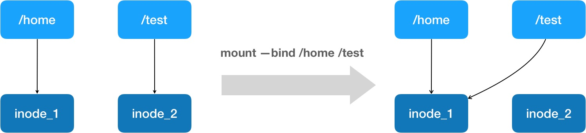
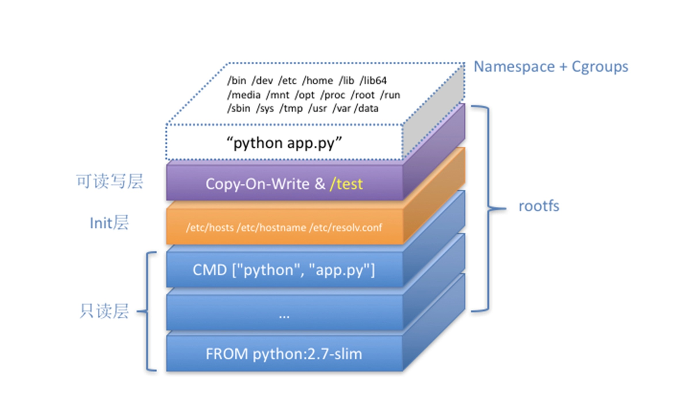

# 白话容器基础（四）：重新认识Docker容器

​	在使用 Dockerfile 时，除了CMD，你可能还会看到一个叫作 ENTRYPOINT 的原语。

​	当使用CMD的shell模式时，例如：

```dockerfile
FROM ubuntu
CMD python app.py
#CMD ["python","app.py"]
```

​	Docker 会为你提供一个隐含的 ENTRYPOINT，即：/bin/sh -c。所以，在不指定 ENTRYPOINT 时，比如在我们这个例子里，实际上运行在容器里的完整进程是：/bin/sh -c "python app.py"，即 CMD 的内容就是 ENTRYPOINT 的参数。

​	当使用CMD的exec模式时，完整进程就是"python app.py"。

​	备注：**基于以上原因，我们后面会统一称 Docker 容器的启动进程为 ENTRYPOINT，而不是 CMD。**

​	需要注意的是，Dockerfile 中的每个原语执行后，都会生成一个对应的镜像层。即使原语本身并没有明显地修改文件的操作（比如，ENV 原语），它对应的层也会存在。只不过在外界看来，这个层是空的。

## 一、docker exec 是怎么做到进入容器里的呢？

​	Linux 内核提供了一种通过 proc 文件系统，在运行时访问内核内部数据结构、改变内核设置的机制。proc 文件系统是一个伪文件系统，它只存在内存当中，而不占用外存空间。它以文件系统的方式为访问系统内核数据的操作提供接口。你可以通过查看宿主机的 proc 文件，看到这个 25686 进程的所有 Namespace 对应的文件：

```shell
$ ls -l  /proc/25686/ns
total 0
lrwxrwxrwx 1 root root 0 Aug 13 14:05 cgroup -> cgroup:[4026531835]
lrwxrwxrwx 1 root root 0 Aug 13 14:05 ipc -> ipc:[4026532278]
lrwxrwxrwx 1 root root 0 Aug 13 14:05 mnt -> mnt:[4026532276]
lrwxrwxrwx 1 root root 0 Aug 13 14:05 net -> net:[4026532281]
lrwxrwxrwx 1 root root 0 Aug 13 14:05 pid -> pid:[4026532279]
lrwxrwxrwx 1 root root 0 Aug 13 14:05 pid_for_children -> pid:[4026532279]
lrwxrwxrwx 1 root root 0 Aug 13 14:05 user -> user:[4026531837]
lrwxrwxrwx 1 root root 0 Aug 13 14:05 uts -> uts:[4026532277]
```

​	可以看到，一个进程的每种 Linux Namespace，都在它对应的 /proc/[进程号]/ns 下有一个对应的虚拟文件，并且链接到一个真实的 Namespace 文件上。

​	有了这样一个可以“hold 住”所有 Linux Namespace 的文件，我们就可以对 Namespace 做一些很有意义事情了，比如：加入到一个已经存在的 Namespace 当中。

​	这也就意味着：一个进程，可以选择加入到某个进程已有的 Namespace 当中，从而达到“进入”这个进程所在容器的目的，这正是 docker exec 的实现原理。

​	而这个操作所依赖的，乃是一个名叫 setns() 的 Linux 系统调用。它的调用方法，我可以用如下一段小程序为你说明：

```c
#define _GNU_SOURCE
#include <fcntl.h>
#include <sched.h>
#include <unistd.h>
#include <stdlib.h>
#include <stdio.h>

#define errExit(msg) do { perror(msg); exit(EXIT_FAILURE);} while (0)

int main(int argc, char *argv[]) {
    int fd;
    
    fd = open(argv[1], O_RDONLY);
    if (setns(fd, 0) == -1) {
        errExit("setns");
    }
    execvp(argv[2], &argv[2]); 
    errExit("execvp");
}
```

​	这段代码的核心操作，则是通过 open() 系统调用打开了指定的 Namespace 文件，并把这个文件的描述符 fd 交给 setns() 使用。在 setns() 执行后，当前进程就加入了这个文件对应的 Linux Namespace 当中了。

​	现在，你可以编译执行一下这个程序，加入到容器进程（PID=25686）的 Network Namespace 中：

```shell
$ gcc -o set_ns set_ns.c 
$ ./set_ns /proc/25686/ns/net /bin/bash 
$ ifconfig
eth0      Link encap:Ethernet  HWaddr 02:42:ac:11:00:02  
          inet addr:172.17.0.2  Bcast:0.0.0.0  Mask:255.255.0.0
          inet6 addr: fe80::42:acff:fe11:2/64 Scope:Link
          UP BROADCAST RUNNING MULTICAST  MTU:1500  Metric:1
          RX packets:12 errors:0 dropped:0 overruns:0 frame:0
          TX packets:10 errors:0 dropped:0 overruns:0 carrier:0
     collisions:0 txqueuelen:0 
          RX bytes:976 (976.0 B)  TX bytes:796 (796.0 B)

lo        Link encap:Local Loopback  
          inet addr:127.0.0.1  Mask:255.0.0.0
          inet6 addr: ::1/128 Scope:Host
          UP LOOPBACK RUNNING  MTU:65536  Metric:1
          RX packets:0 errors:0 dropped:0 overruns:0 frame:0
          TX packets:0 errors:0 dropped:0 overruns:0 carrier:0
    collisions:0 txqueuelen:1000 
          RX bytes:0 (0.0 B)  TX bytes:0 (0.0 B)
```

​	

## 二、现在，我们再一起回到前面提交镜像的操作 docker commit 上来吧

​	`docker commit`，实际上就是在容器运行起来后，把最上层的“可读写层”，加上原先容器镜像的只读层，打包组成了一个新的镜像。当然，下面这些只读层在宿主机上是共享的，不会占用额外的空间。**上述的操作都是在宿主机上进行的。**

​	而由于使用了联合文件系统，你在容器里对镜像 rootfs 所做的任何修改，都会被操作系统先复制到这个可读写层，然后再修改。这就是所谓的：Copy-on-Write。

​	而正如前所说，Init 层的存在，就是为了避免你执行 `docker commit` 时，把 Docker 自己对 /etc/hosts 等文件做的修改，也一起提交掉。

## 三、Volume 机制，允许你将宿主机上指定的目录或者文件，挂载到容器里面进行读取和修改操作。

```shell
$ docker run -v /test ...
$ docker run -v /home:/test ...
```

​	在第一种情况下，由于你并没有显示声明宿主机目录，那么 Docker 就会默认在宿主机上创建一个临时目录 /var/lib/docker/volumes/[VOLUME_ID]/_data，然后把它挂载到容器的 /test 目录上。

​	我们只需要在 rootfs 准备好之后，在执行 chroot 之前，把 Volume 指定的宿主机目录（比如 /home 目录），挂载到指定的容器目录（比如 /test 目录）在宿主机上对应的目录（即 /var/lib/docker/aufs/mnt/[可读写层 ID]/test）上，这个 Volume 的挂载工作就完成了。

​	更重要的是，由于执行这个挂载操作时，“容器进程”已经创建了，也就意味着此时 Mount Namespace 已经开启了。所以，这个挂载事件只在这个容器里可见。你在宿主机上，是看不见容器内部的这个挂载点的。**这就保证了容器的隔离性不会被 Volume 打破。**

​			**注意：这里提到的"容器进程"，是 Docker 创建的一个容器初始化进程 (dockerinit)，而不是应用进程 (ENTRYPOINT + CMD)。dockerinit 会负责完成根目录的准备、挂载设备和目录、配置 hostname 等一系列需要在容器内进行的初始化操作。最后，它通过 execve() 系统调用，让应用进程取代自己，成为容器里的 PID=1 的进程。**

​	这里要使用到的挂载技术，就是 Linux 的绑定挂载（bind mount）机制。它的主要作用就是，允许你将一个目录或者文件，而不是整个设备，挂载到一个指定的目录上。并且，这时你在该挂载点上进行的任何操作，只是发生在被挂载的目录或者文件上，而原挂载点的内容则会被隐藏起来且不受影响。

​	其实，如果你了解 Linux 内核的话，就会明白，绑定挂载实际上是一个 inode 替换的过程。在 Linux 操作系统中，inode 可以理解为存放文件内容的“对象”，而 dentry，也叫目录项，就是访问这个 inode 所使用的“指针”。



​	正如上图所示，`mount --bind  /home  /test`，会将 /home 挂载到 /test 上。其实相当于将 /test 的 dentry，重定向到了 /home 的 inode。这样当我们修改 /test 目录时，实际修改的是 /home 目录的 inode。这也就是为何，一旦执行 umount 命令，/test 目录原先的内容就会恢复：因为修改真正发生在的，是 /home 目录里。

​	**所以，在一个正确的时机，进行一次绑定挂载，Docker 就可以成功地将一个宿主机上的目录或文件，不动声色地挂载到容器中。**

​	这样，进程在容器里对这个 /test 目录进行的所有操作，都实际发生在宿主机的对应目录（比如，/home，或者 /var/lib/docker/volumes/[VOLUME_ID]/_data）里，而不会影响容器镜像的内容。

​	那么，这个 /test 目录里的内容，既然挂载在容器 rootfs 的可读写层，它会不会被 `docker commit` 提交掉呢？

​	也不会。

​	这个原因其实我们前面已经提到过。容器的镜像操作，比如 `docker commit`，都是发生在宿主机空间的。而由于 Mount Namespace 的隔离作用，宿主机并不知道这个绑定挂载的存在。所以，在宿主机看来，容器中可读写层的 /test 目录（/var/lib/docker/aufs/mnt/[可读写层 ID]/test），**始终是空的。**

​	不过，由于 Docker 一开始还是要创建 /test 这个目录作为挂载点，所以执行了 docker commit 之后，你会发现新产生的镜像里，会多出来一个空的 /test 目录。毕竟，新建目录操作，又不是挂载操作，Mount Namespace 对它可起不到“障眼法”的作用。

​	结合以上的讲解，我们现在来亲自验证一下：首先，启动一个 helloworld 容器，给它声明一个 Volume，挂载在容器里的 /test 目录上：

​	

```shell
$ docker run -d -v /test helloworld
cf53b766fa6f
```

​	容器启动之后，我们来查看一下这个 Volume 的 ID：

```shell
$ docker volume ls
DRIVER              VOLUME NAME
local               cb1c2f7221fa9b0971cc35f68aa1034824755ac44a034c0c0a1dd318838d3a6d
```

​	然后，使用这个 ID，可以找到它在 Docker 工作目录下的 volumes 路径：

```shell
$ ls /var/lib/docker/volumes/cb1c2f7221fa/_data/
```

​	这个 _data 文件夹，就是这个容器的 Volume 在宿主机上对应的临时目录了。接下来，我们在容器的 Volume 里，添加一个文件 text.txt：

```shell
$ docker exec -it cf53b766fa6f /bin/sh
cd test/
touch text.txt
```

​	这时，我们再回到宿主机，就会发现 text.txt 已经出现在了宿主机上对应的临时目录里：

```shell
$ ls /var/lib/docker/volumes/cb1c2f7221fa/_data/
text.txt
```

​	可是，如果你在宿主机上查看该容器的可读写层，虽然可以看到这个 /test 目录，但其内容是空的（关于如何找到这个 AuFS 文件系统的路径，请参考我上一次分享的内容）：

```shell
$ ls /var/lib/docker/aufs/mnt/6780d0778b8a/test
```

​	可以确认，容器 Volume 里的信息，并不会被 `docker commit` 提交掉；但这个挂载点目录 /test 本身，则会出现在新的镜像当中。


## 四、总结



​	这个容器进程“python app.py”，运行在由 Linux Namespace 和 Cgroups 构成的隔离环境里；而它运行所需要的各种文件，比如 python，app.py，以及整个操作系统文件，则由多个联合挂载在一起的 rootfs 层提供。

​	这些 rootfs 层的最下层，是来自 Docker 镜像的只读层。

​	在只读层之上，是 Docker 自己添加的 Init 层，用来存放被临时修改过的 /etc/hosts 等文件。

​	而 rootfs 的最上层是一个可读写层，它以 Copy-on-Write 的方式存放任何对只读层的修改，容器声明的 Volume 的挂载点，也出现在这一层。


## 五、思考题

1. 你在查看 Docker 容器的 Namespace 时，是否注意到有一个叫 cgroup 的 Namespace？它是 Linux 4.6 之后新增加的一个 Namespace，你知道它的作用吗？
3. 请尝试给这个 Python 应用加上 CPU 和 Memory 限制，然后启动它。根据我们前面介绍的 Cgroups 的知识，请你查看一下这个容器的 Cgroups 文件系统的设置，是不是跟我前面的讲解一致。


## 附：慎用 `docker commit`

​	使用 `docker commit` 命令虽然可以比较直观的帮助理解镜像分层存储的概念，但是实际环境中并不会这样使用。

​	首先，如果仔细观察之前的 `docker diff webserver` 的结果，你会发现除了真正想要修改的 `/usr/share/nginx/html/index.html` 文件外，由于命令的执行，还有很多文件被改动或添加了。这还仅仅是最简单的操作，如果是安装软件包、编译构建，那会有大量的无关内容被添加进来，将会导致镜像极为臃肿。

​	此外，使用 `docker commit` 意味着所有对镜像的操作都是黑箱操作，生成的镜像也被称为 **黑箱镜像**，换句话说，就是除了制作镜像的人知道执行过什么命令、怎么生成的镜像，别人根本无从得知。而且，即使是这个制作镜像的人，过一段时间后也无法记清具体的操作。这种黑箱镜像的维护工作是非常痛苦的。

​	而且，回顾之前提及的镜像所使用的分层存储的概念，除当前层外，之前的每一层都是不会发生改变的，换句话说，任何修改的结果仅仅是在当前层进行标记、添加、修改，而不会改动上一层。如果使用 `docker commit` 制作镜像，以及后期修改的话，每一次修改都会让镜像更加臃肿一次，所删除的上一层的东西并不会丢失，会一直如影随形的跟着这个镜像，即使根本无法访问到。这会让镜像更加臃肿。
