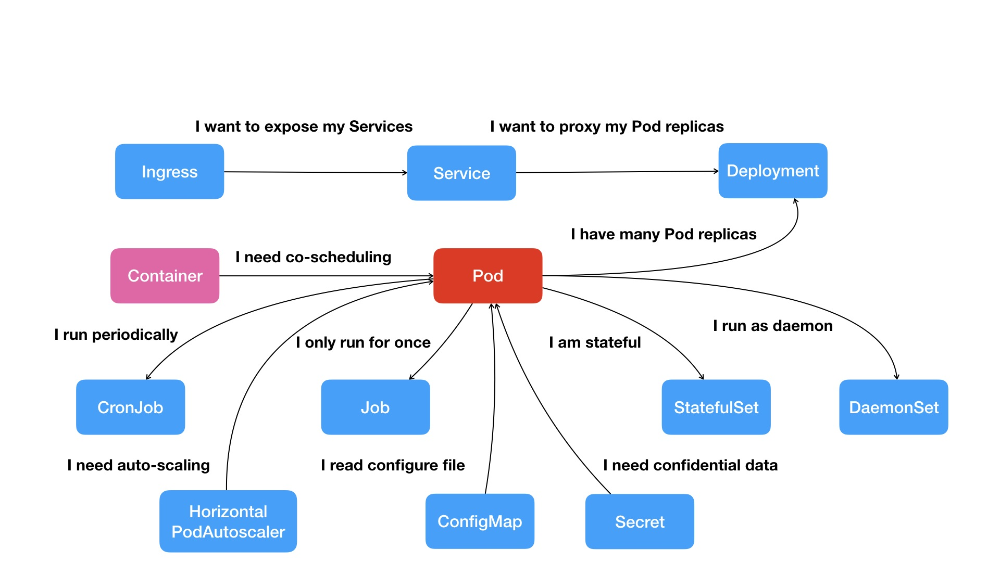

# 从容器到容器云：谈谈Kubernetes的本质

​	Kubernetes 的大致工作流程了：

- 每个 Node 上的 kubelet 会定期向 apiserver 上报节点状态，apiserver 再存到 etcd 里。
- 每个 Node 上的 kube-proxy 实现了 TCP/UDP 反向代理，让容器对外提供稳定的服务。
- scheduler 通过 apiserver 得到当前的节点状态，调度 Pod，然后 apiserver 下发命令给某个 Node 的 kubelet，kubelet 调用 container-runtime 启动容器。
- controller-manager 也通过 apiserver 得到实时的节点状态，监控可能的异常情况，再使用相应的手段去调节恢复。

## 一、kubelet（完全就是为了实现 Kubernetes 项目对容器的管理能力而重新实现的一个组件）

​	**在 Kubernetes 项目中，kubelet 主要负责同容器运行时（比如 Docker 项目）打交道**。而这个交互所依赖的，是一个称作 CRI（Container Runtime Interface）的远程调用接口，这个接口定义了容器运行时的各项核心操作，比如：启动一个容器需要的所有参数。

​	这也是为何，Kubernetes 项目并不关心你部署的是什么容器运行时、使用的什么技术实现，只要你的这个容器运行时能够运行标准的容器镜像，它就可以通过实现 CRI 接入到 Kubernetes 项目当中。

​	而具体的容器运行时，比如 Docker 项目，则一般通过 OCI 这个容器运行时规范同底层的 Linux 操作系统进行交互，即：把 CRI 请求翻译成对 Linux 操作系统的调用（操作 Linux Namespace 和 Cgroups 等）。

​	**而 kubelet 的另一个重要功能，则是调用网络插件和存储插件为容器配置网络和持久化存储**。这两个插件与 kubelet 进行交互的接口，分别是 CNI（Container Networking Interface）和 CSI（Container Storage Interface）。

## 二、Kubernetes设计理念

​	Kubernetes 项目最主要的设计思想是，从更宏观的角度，以统一的方式来定义任务之间的各种关系，并且为将来支持更多种类的关系留有余地。

	

​	在 Kubernetes 项目中，我们所推崇的使用方法是：

​	1、首先，通过一个“编排对象”，比如 Pod、Job、CronJob 等，来描述你试图管理的应用；

​	2、然后，再为它定义一些“服务对象”，比如 Service、Secret、Horizontal Pod Autoscaler（自动水平扩展器）等。这些对象，会负责具体的平台级功能。

**这种使用方法，就是所谓的“声明式 API”。这种 API 对应的“编排对象”和“服务对象”，都是 Kubernetes 项目中的 API 对象（API Object）。**